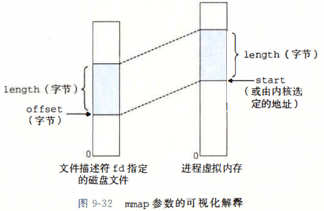

# 第8章 异常控制流

## 8.1 异常

- 异常就是控制流中的突变，用来响应处理器状态中的某些变化。


当处理器检测到有事件发生时，就通过异常表的跳转表，进行一个间接过程调用，到一个专门处理这类事件的OS子程序。

### 8.1.1 异常处理

系统中可能的每种类型异常都分配了一个唯一的非负整数：异常号。其中一些由处理器设计者分配，另一些由OS内核(OS常驻内存部分)设计者分配。前者包括被零除、缺页、内存方文伟里、断点以及算数溢出；后者包括系统调用、外部I/O信号。

在系统启动时，OS分配和初始化**异常表**。异常号到是到异常表的索引，异常表的起始地址放在**异常表基址寄存器**中。


异常调用类似过程调用，但也有不同：

1. 过程调用过程调用时， 在跳转到处理程序之前，处理器将返回地址压入栈中。然而根据异常的类型，返回地址要么是当前指令(当事件发生时正在执行的指令)，要么是下一条指令。
2. 处理器也会把一些额外的处理器状态压入栈中，当处理程序返回，重新开始执行被中断程序会需要这些状态。
3. 如果控制从用户程序转移到内核，这些项目都被压到内核栈中，而不是用户栈中。
4. 异常处理程序运行在内核模式下，所以它们对所有系统资源都有完全访问权限。

### 8.1.2 异常的类别

| 类别 | 原因              | 异步/同步 | 返回行为             |
| ---- | ----------------- | --------- | -------------------- |
| 中断 | 来自I/O设备的信号 | 异步      | 总是返回到下一条指令 |
| 陷阱 | 有意的异常        | 同步      | 总是返回到下一条指令 |
| 故障 | 潜在可恢复的错误  | 同步      | 可能返回到当前指令   |
| 终止 | 不可恢复的错误    | 同步      | 不会返回             |

异步：异常不是由任何专门指令造成的。

同步：异常是执行当前指令的结果。

---

- 中断

中断是来自CPU外部的I/O设备的信号的结果。它不由任何一条专门的指令造成，所以它是异步的。


- 陷阱和系统调用

陷阱是有意的异常，是一条指令的结果。陷阱最重要的用途就是**在用户程序和内核之间提供一个像过程一样的接口，叫做系统调用**。

用户经常需要向内核请求服务，如读文件(read)、创建新的进程(fork)、加载新程序(execve)，终止当前进程(exit)。**为了允许对这些内核服务的受控的访问，CPU提供了"syscall n"指令**。执行syscall指令会导致一个陷阱的异常处理程序，它可以解析参数并调用适当的内核程序。


普通函数运行在**用户模式**，限制了函数可以执行的指令的类型，而且只能访问与调用函数相同的栈。系统调用运行在**内核模式**，允许系统调用执行特权指令，并访问定义在内核中的栈。


- 故障

故障由错误情况引起，可能可以被故障处理程序修正。如果CPU能修正，就将控制返回到引起故障的指令，重新执行；否则处理程序返回内核中的abort例程，终止程序。


一个经典的故障就是缺页异常。当指令引用一个虚拟地址，而与改地址相对应的物理页面不在内存中，因此必须从磁盘中取出时，就会发生故障。缺页处理程序从磁盘加载适当的页面，然后将控制返回给引起故障的指令。当指令再次执行时，相应的物理页面已经驻留在内存中，就可以正常运行了。


- 终止

通常是一些硬件错误，不可恢复。处理程序直接交给abort例程，终止程序。

---

### 8.1.3 Linux/x86-64系统中的异常

所有到Linux系统调用的参数都是通过通用寄存器而不是栈传递的。


```c
int main(){
    write(1,"hello, world\n",13);
    _exit(0);
}
```

write函数的第一个参数将输出发送到stdout。第二个参数是要写的字节序列，第三个参数是要写的字节数。

## 8.2 进程

- 进程的经典定义：一个执行中程序的实例。

系统中的每个程序都运行在某个进程上下文中。

### 8.2.2 并发流

- 一个逻辑流的执行在时间上与另一个流重叠，称为**并发流**。多个流并发的执行被称为**并发**。


### 8.2.3 私有地址空间

进程为每个程序提供一种假象，好像它独占地使用系统地址空间。


### 8.2.4 用户模式和内核模式

CPU通过某个控制寄存器中的一个**模式位**描述进程当前享有的特权：内核模式和用户模式。


Linux提供/proc文件系统，它允许用户模式进程访问内核数据结构的内容。/proc文件系统将许多内核数据结构的内容的内容输出位一个用户程序可以读的文本文件的层次结构。比如CPU类型(/proc/cpuinfo)

### 8.2.5 上下文切换

- 内核为每个进程维持一个上下文


## 8.4 进程控制

### 8.4.1 获取进程ID

- 每个进程都有一个唯一的正数(非零)进程ID(PID)。

```c
#include<sys/types.h>
#include<unistd.h>

pid_t getpid(void);		//getpid函数返回进程PID
pid_t getppid(void);	//getppid函数返回它的父进程的PID
```

Linux系统上pid_t在types.h被定义为int。

### 8.4.2 创建和终止进程


```c
#include<stdlib.h>

void exit(int status);
```

exit函数以status退出状态来终止进程

---

```c
#include<sys/types.h>
#include<unistd.h>

pid_t fork(void);
```

新创建的子进程几乎但不完全与父进程相同。子进程得到与父进程用户级虚拟地址空间相同的(但是独立的)**一份副本**，包括代码和数据段、堆、共享库以及用户栈。子进程还活的与父进程任何打开文件描述符相同的副本。**子进程可以读写父进程中打开的任何文件**。

### 8.4.3 回收子进程

- 当一个进程终止时，内核并不是立刻把它清除。而是把它保持在一种终止状态，直到被它的父进程回收。

当父进程回收已终止子进程的时候，内核将子进程的退出状态传递给父进程，然后抛弃已终止的进程。

一个终止但还未被回收的进程称为**僵死进程**。

---


---

一个进程可以通过waitpid等待他的子进程终止：

```c
#include<sys/types.h>
#include<sys/wait.h>

pid_t waitpid(pid_t pid, int *startusp, int options);
```

默认情况下(当options=0时)，waitpid挂起调用进程的执行，直到它的等待集合中的一个子进程终止。此时该函数返回已终止子进程的PID。

- 判定等待集合的成员

**等待集合的成员是由参数pid确定的**：

如果pid>0，那么等待集合就是一个单独的子进程，他的进程ID等于pid；

如果pid=-1，那么等待集合就是由父进程所有的子进程组成的。

- 修改默认行为

通过将options设置为常量：WNOHANG、WUNTRACED和WCONTINUED的各种组合来修改默认行为


- 检查已回收子进程的退出状态

如果`statusp`参数是非空的，那么`waipid`就会在`status`中放入导致返回的子进程的状态信息。


- 错误条件

如果调用进程没有子进程，那么`waitpid`返回-1，并且设置`errno`为`ECHILD`。如果`waitpid`函数被一个信号中断，那么返回-1，设置`errno`为`EINTR`。(为了检查`ECHILD`和`EINTR`必须包含`errno.h`头文件)

---

`wait`函数：是`waitpid`的简单版本

```c
#include<sys/types.h>
#include<sys/wait.h>

pid_t wait(int *statusp);
```

调用`wait(&status)`等价于调用`waitpid(-1.&status,0)`。

### 8.4.4 让进程休眠

`sleep`函数将一个进程挂起一段指定时间；`pause`函数让调用进程休眠，直到该进程收到一个信号：

```c
#include<unistd.h>

unsigned int sleep(unsigned int secs);
int pause(void);
```

如果请求的时间量到了，sleep返回0，否则返回还剩下要休眠的秒数(因为sleep函数被一个信号中断而过早返回)。

### 8.4.5 加载并运行程序

`execve`函数在当前进程的上下文中加载并运行一个新程序：

```c
#include<unistd.h>

int execve(const char * filename, const char *argv[],const char *envp[]);
```

加载并运行可执行目标文件`filename`，带参数列表`argv`和环境变量列表`envp`，只有出现错误才会返回到调用程序。**execve从不返回**。

**Hint**：参数`argv[0]`是可执行文件的名字，所以更多参数从`argv[1]`开始。


当main开始执行的时候，用户栈的组织结构：


---

`fork()`和`execve()`的区别(即进程和程序的区别)：

- fork在新的子进程中运行相同的程序，新的子进程是父进程的一个复制品。
- execve在当前进程的上下文中加载并运行新的程序。**会覆盖当前进程的地址空间**，但并没有创建新进程，而**保持了PID**，并且**继承了调用`execve`时候的所有已打开的文件描述符**。

## 8.5 信号

- Linux信号，允许进程和内核中断其它进程。

### 8.5.1 信号术语

传送一个信号到目的进程由两个步骤组成：

- **发送信号**：内核通过更新目的进程上下文中的某个状态，发送一个信号给目的进程上下文。发送信号有两个二原因：

1. 内核检测到一个系统事件，比如除0错误或者子进程终止。
2. 一个进程调用了`kill`函数显式要求内核发送一个信号给目的进程。

- **接收信号**：当目的进程被内核强迫以某种方式对信号做出反应时，它就**接收**了信号。进程可以忽略、终止或者执行**信号处理函数**的用户层函数捕获该信号。

---

一个发出而没有被接收的信号叫**待处理信号**。一种类型至多只有一个待处理信号。如果一个进程有一个类型为k的待处理信号，那么接下来发送给该进程类型为k的信号都不会排队等待，而是直接丢弃。  一个进程可以有选择地**阻塞**接收某种信号。当一种信号被阻塞时，仍可以被发送，但是产生的待处理信号不会被接收，直到进程取消对这种信号的阻塞。


### 8.5.2 发送信号

Unix系统发送信号的机制都是基于**进程组**这个概念的。

- 进程组

`getpgrp`返回当前进程的进程组ID：

```c
#include<unistd.h>

pid_t getpgrp(void);
```

默认情况下，子进程和父进程同属一个进程组。可以通过`setpgid`改变自己活着其他进程的进程组：

```c
#include<unistd.h>

int setpgid(pid_t pid,pid_t pgid);
```

`setpgid`将进程`pid`的进程组改为`pgid`。如果`pid`是0，那么就使用当前进程的PID。如果`pgid`是0那么就用`pid`指定的进程的`PID`作为进程组ID。

---

- 用`/bin/kill`程序发送信号


---

- 从键盘发送信号

shell使用**作业**(jod)这一抽象概念来表示对一条命令行求值而创建的程序。在任何时刻，最多**只有一个前台作业和多个后台作业**


---

- 用`kill`函数发送信号

```c
#include<sys/types.h》
#include<signal.h>

int kill(pid_t pid,int sig);
```

如果`pid`大于0，`kill`发送给信号号码`sig`给进程`pid`；

如果`pid`等于0，`kill`发送信号`sig`给调用进程所在进程组中的每个进程，包括调用进程自己；

如果`pid`小于0，`kill`发送信号`sig`给进程组|pid|中的每个进程。

---

- 用alarm函数发送信号

进程可以通过调用`alarm`函数向他自己发送SIGALRM信号：

```c
#include<unistd.h>

unsigned int alarm(unsigned int secs);
```

`alarm`函数安排内核在secs秒后发送一个SIGALRM信号给调用进程。

### 8.5.3 接收信号


每个信号类型都有一个预定义的默认行为：

- 进程终止
- 进程终止并转储内存
- 进程停止(挂起)直到被SIGCONT信号重启
- 进程忽略该信号


进程可以通过`signal`函数修改和信号相关联的默认行为。然而**SIGSTOP和SIGKILL的默认行为是不可修改的**。

```c
#include<signal.h>

//返回值void，参数为int的函数指针的typedef
typedef void (*sighandler_t)(int);
sighandler_t signal(int signum,sighandler_t handler);
```

`signal`函数可以通过以下三种方式之一修改和信号signum相关的行为：

- 如果handler是SIG_IGN，那么忽略类型为signum的信号
- 如果handler是SIG_DFL，那么类型为signum的信号行为恢复为默认行为
- 否则，handler就是用户定义的函数地址，**信号处理程序**，只要进程接受到一个类型为signum的信号就会调用这个程序。调用信号处理程序被称为**捕获信号**。执行被称为**处理信号**。


信号处理程序也可以被其他信号处理程序中断：


### 8.5.4 阻塞和解除阻塞信号

Linux提供阻塞信号的隐式和显式的机制：

- 隐式阻塞机制。内核默认阻塞任何当前处理程序正在处理信号类型的待处理信号。
- 显式阻塞机制。应用程序可以使用`sigprocmask`函数和它的辅助函数，明确阻塞和解除阻塞选定的信号。

```c
#include<signal.h>


int sigprocmask(int how,const sigset_t *set,sigset_t *oldset);


//初始化set为空集合
int sigemptyset(sigset_t *set);


//把每个信号都添加到set中
int sigfillset(sigset_t *set);

//把signum添加到set
int sigaddset(sigset_t *set, int signum);

//把signum从set中删除
int sigdelset(sigset_t *set, int signum);

//如果signum是set中的成员就返回1；否则返回0
int sigismember(const sigset_t *set,int signum);
```

`sigprocmask`函数改变当前阻塞的信号集合，行为依赖于`how`：

SIG_BLOCK：把set中的信号添加到blocked中(blocked=blocked |set)。

SIG_UNBLOCK：从blocked中删除set中的信号(blocked=blocked &~set)。

SIG_SETMASK：block=set。

如果oldset非空，那么block位向量之前的值保存在oldset中。


使用示例：


### 8.5.5 编写信号处理程序

信号处理程序和主程序并发运行，共享相同的全局变量，因此可能与主程序和其他处理程序互相干扰。

---

- 信号处理程序中产生输出唯一安全的方法是使用write函数。调用printf和sprintf是不安全的。
- 保存和恢复errno
- 阻塞所有信号，保护对共享全局数据结构的访问
- 用volatile声明全局变量
- 用sig_atomic_t声明标志

---

正确的信号处理：


感觉剩下的过于虚幻......


# 第9章 虚拟内存

## 9.1 物理和虚拟寻址

计算机系统的主存被组织成一个由M个连续字节大小的单元组成的数组。每个字节都有一个唯一的物理地址。


当CPU执行加载指令时，会生成一个有效物理地址，通过**内存总线**传递给主存。主存取出物理地址的内容返回给CPU，CPU会将它存放在一个寄存器里。

## 9.3 虚拟内存作为缓存的工具

磁盘上数组被分割成块。VM系统通过将虚拟内存分割为称为**虚拟页**的大小固定的块。

### 9.3.1 DRAM缓存的组织结构

DRAM比SRAM慢大约10倍，磁盘比DRAM慢大约100000多倍。因此DRAM缓存中的不命中比SRAM缓存中的不命中昂贵的多，因为DRAM缓存不命中要由磁盘来服务。   从磁盘的一个扇区读取第一个字节的时间开销比起读这个扇区中连续的字节要慢大约100000倍。

因为大的不命中触发和访问第一个字节的开销，**虚拟页往往很大**。DRAM缓存是全相联的，**任何虚拟页都可以放在任何的物理页中**

### 9.3.2 页表

- 页表：存放在物理内存中的数据结构，是一个**页表条目(PTE)的数组**。

假设每个PTE由一个有效位和一个n位地址字段组成。**有效位表明该虚拟页当前是否被缓存在DRAM中**，如果设置有效位，地址字段标识DRAM中相应物理也的起始位置；如果没有设置有效位。一个空地址标识这个虚拟页还未被分配，否则这个地址就指向该虚拟页在磁盘上的起始位置。


### 9.3.4 缺页

- 缺页：DRAM缓存不命中称为缺页。

缺页异常调用**内核中的**缺页异常处理程序，选择一个牺牲页，将它复制回磁盘；再从磁盘复制缺的那一页到内存中，并更新页表中对应的PTE。异常处理程序返回时，**重启导致缺页的指令，该指令把导致缺页的虚拟地址重发送到地址翻译硬件**。

### 9.3.5 分配页面

例如 调用malloc时；页面的分配过程是**在磁盘上创建空间并更新PTE n，使它指向磁盘上这个新创建的页面**。

## 9.4 虚拟内存作为内存管理工具

多个虚拟页面可以映射到同一个共享物理页面上：


一般而言，每个进程都有自己私有的代码、数据、堆以及栈区域，是不和其他进程共享的。这种情况下，OS创建页表，**将相应的虚拟页映射到不连续的物理页面**。

## 9.5 虚拟内存作为内存保护的工具

通过在PTE上添加一些额外的许可位来控制对一个虚拟页面内容的访问十分简单。


SUP位标识晋城市否必须运行在内核模式下才能访问该页。

如果一条指令违反了许可条件，CPU就触发一个一般保护故障。Linux shell一般将这种一场报告为"段错误"(segmentation fault)

## 9.6 地址翻译

n位虚拟地址包含两个部分：一个p位的虚拟页面偏移和一个(n-p)位的虚拟页号


### 9.6.2 利用TLB加速地址翻译

在MMU中包括了一个关于PTE的小的缓存，称为翻译后备缓冲器(TLB)

TLB中每一行都保存着一个由单个PTE组成的块。


TLB索引是由VPN的t个最低位组成，TLB标记由VPN剩余的位组成的。

### 9.6.3 多级页表


第k级页表中的每个PTE包含某个物理页面的PPN

---

页表：VPN并不是页表的一部分，也不储存在内存中。


## 9.8 内存映射

Linux通过将一个虚拟内存区域与一个磁盘上的对象关联起来，以初始化这个虚拟内存区域的内容，虚拟内存可以映射到两种类型的对象：


### 9.8.1 共享对象

一个对象可以被映射到虚拟内存的一个区域，要么作为**共享对象**，要么作为**私有对象**。

- 一个进程对共享区域的任何写操作，对那些把该共享对象映射到它们虚拟内存的进程而言，也是可见的。而且这些变化**会反映在磁盘的原始对象中**。
- 对一个映射到私有对象的区域做改变，对于其他进程来说是不可见的。也**不会反映在磁盘上的起始位置对象中**。


- 私有对象使用**写时复制**(copy-on-write)技术被映射到虚拟内存中。


对于每个映射私有对象的进程，相应私有区域的页表条目都被标记为只读，并且区域结构被标记为**私有的写时复制**。只要没有进程试图写它自己的宿友区域，它们就可以共享物理内存中对象的一个单独副本。**只要有一个进程试图写私有区域的某个页面**，这个写操作就会触发**保护故障**。

故障处理程序：在物理内存中创建这个页面的一个新副本。更新页表条目指向这个新的副本。然后恢复这个页面的可写权限。当故障处理程序返回时，CPU重新执行写操作，就可以在新创建的页面上执行写操作了。

然后，进程2进程会修改复制出来的页面，而不是属于进程1的页面。显然，当使用写时复制技术时，**仅复制任何一进程修改的页面**，**所有未修改的页面可以由两个进程共享**。

### 9.8.2 再看`fork`函数

当`fork`函数被当前进程调用时，内核为新进程创建各种数据结构并分配一个唯一的PID。它将两个进程中的每个页面都标记为只读，并将两个进程中每个区域结构都标记为私有的写时复制。

当`fork`在新进程中返回时，新进程现在的虚拟内存刚好和调用`fork`时存在的虚拟内存相同。当两个进程中的人一个后来进行写操作时，写时复制机制就会创建新页面，因此，就位每个进程保持了**私有地址空间的抽象概念**。

### 9.8.3 再看`execve`函数

在当前进程执行：

```c
execve("a.out",NULL,NULL);
```

`execve`函数在当前进程中加载并运行包含在可执行目标文件中的程序，用该程序代替当前程序。

记载并运行a.out需要以下步骤：

- 删除已存在的用户区域：删除当前进程虚拟地址的用户部分中的已存在的区域结构
- 映射私有区域：为新程序的代码、数据、bss和栈区域创建新的区域结构。所有这些新的区域都是**私有的、写时复制的**。

- 映射共享区域：如果a.out程序与共享对象链接，比如标准C库libc.so，那么这些对象都是动态链接到该程序的，然后再映射到用户虚拟地址空间中的共享区域内。
- 设置程序计数器(PC)：设置当前进程上下文中的程序计数器，使之指向代码区域的入口点。


### 9.8.4 使用`mmap`函数的用户级内存映射

Linux进程可以使用`mmap`函数创建新的虚拟内存区域，将对象映射到这些区域中：

```c
#include<unistd.h>
#include<sys/mman.h>

void *mmap(void *start, size_t length, int prot, int flags, int fd, off_t offset);
```

`mmap`函数要求内核创建一个新的虚拟内存区域，最好是从地址`start`开始的一个区域，并将文件描述符`fd`指定的对象的一个连续的片映射到这个新的区域。连续的对象片大小为`length`字节，从距文件开始处偏移量为offset字节的地方开始。`start`地址仅仅是一个暗示，通常被定义为NULL



参数`prot`包含描述新映射的虚拟内存区域的访问权限位(即在相应区域结构中的vm_prot位)。

- PROT_EXEC：这个区域内的页面可以被CPU执行的指令组成。
- PROT_READ：这个区域的页面可读。
- PROT_WRITE：这个区域内的页面可写。
- PROT_NONE：这个区域内的页面不能被访问。

参数`flags`由描述被映射对象类型的位组成。


让内核创建一个新的包含size字节的只读、私有、请求二进制零的虚拟内存区域。若调用成功，那么bufp包含新区域的地址。


