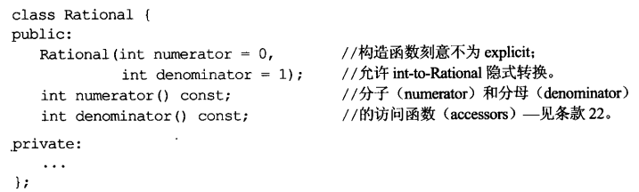

# 条款1 视C++为一个语言联邦

没啥好说的


# 条款2 尽量以const, enum, inline替换#define

- 宏定义的变量可能不会进入符号表(symbol table)

在define之后，可能在运用该常量的过程中获得一个编译错误，这个错误也许会提到定义的结果，而不会提到那个常量的名字，这样会导致困惑，因为需要追踪那个常量就显得十分困难。

const定义的**语言常量**肯定会被编译器看到，因此会进入符号表

- 宏定义无法创建class专属常量

**#define 不重视作用域**

一旦宏被定义，就在其后的变异过程中有效  所以#define也没有封装性

- 一个属于枚举类型的数值可以充当int使用

```
#class GamePlayer{
private:
	enum{NumTurns=5};

	int scores[NumTurns];
};
```

- 对于形如函数的宏，最好用inline函数替换#define

**现代编译器会自动inline，而不是根据编写代码者是否添加inline来判断**


# 条款3 尽可能使用const

T* const  指针不得指向不同东西

const T*       T const*   指针指向的东西不可变动

**class的const成员函数可以操作const对象**

**如果函数返回类型是内置类型，那么改动函数返回值不合法**    **对返回值的改动必须要求函数返回值是左值引用**

**const成员函数可以使用类的成员，但不能修改他们**

**类的const成员变量（常量）只能通过构造函数的初始化列表**


# 条款4 确定对象被使用前已被初始化

**在使用前确保初始化**

**构造函数一定要用member initialization list进行构造 而不是对于每个成员挨个赋值**

**原因在于 基于赋值的版本会先调用default构造函数对成员进行默认初始化，然后再调用这个版本的构造函数进行赋值动作的初始化**

**效率远远不如member initialization list的构造**

**如果成员变量是const或reference，就一定需要初值，不能被赋值**

**C++有十分固定的成员初始化次序，class的成员变量总是以其声明次序被初始化，不论它们在构造函数中的顺序是什么样的 但是最好按照声明顺序进行初始化**

**Singleton模式**：

C++在多单元编译的时候  编译顺序具有不确定性  **以local static对象 替换non-local static对象**   **这部分注意看原书**


# 条款5 了解C++默默编写并调用哪些函数

默认函数只在被需要的时候才产生

编译器产出的析构函数是non-virtual的

**在内含const成员、reference成员的类中，编译器会拒绝编译赋值操作的代码。因为C++并不允许 让reference和const对象改指向不同对象**


# 条款6 若不想使用编译器自动生成的函数，就该明确拒绝

侯捷给出的做法是将拷贝相关函数声明为private并且不予实现  **过时**

C++11可以通过在相关函数的声明后跟=delete 实现删除该函数

1.将拷贝函数声明为private并不绝对安全 因为成员函数和友元函数还是可以调用private函数

2.如果定义为private且不定义的话  对它们的调用将会获得一个 **链接错误**

所以其实还是不太方便


# 条款7 为多态基类声明virtual析构函数

派生类对象被绑定到基类指针或者引用上  在调用析构函数时，如果不是virtual析构函数，那么派生类中的部分没有被销毁

**欲实现virtual函数 对象必须携带某些信息 主要用来在运行期决定哪一个virtual函数被调用**  **这些信息通常由vptr指针指出  vptr指向一个由函数指针构成的数组，称为vtbl(virtual table)**   **每一个带有virtual函数的class都有一个相应的vtbl 当对象调用某一virtual函数 实际上取决于该对象的vptr所指向的那个vtbl**

**如果类内包含virtual函数，其对象体积会增加**


# 条款8 别让异常逃离析构函数

类不希望析构函数可以产生异常

析构函数应该捕捉任何异常 然后吞下它们或结束程序

如果需要对某个操作函数运行期间抛出的异常做出反应，那么class应该提供一个普通函数而非在析构函数中执行该操作


# 条款9 绝不在构造或析构函数中调用virtual函数

如果在构造函数中调用virtual函数  那么创建一个派生类对象的时候 基类构造优先于派生类构造 此时调用的virtual函数是基类的对应函数  **因为在base class构造期间 virtual函数不是virtual函数** 

**在派生类对象的基类构造期间，对象的类型是base class而不是derived class**

不止virtual函数会被编译器解析之base class，如果使用运行期类型信息 入dynamic-cast和typeid 也会把对象视作base class

一个可行的做法是 在derived class的构造函数中 将一个static派生类对象作为参数传递给base class的构造函数  这样就避免了调用一个未初始化/未生成的对象


# 条款10 令operator=返回一个reference to *this

内置数据类型可以连锁赋值   如果希望自定义数据类型也支持连锁赋值 **那么必须令operator=返回一个*this的引用** 


# 条款11 在operator=中处理“自我赋值”

不要认为自我赋值不存在  

```cpp
a[i]=a[j]   //潜在的自我赋值
```

这一类并不明显的自我赋值  是“别名”带来的结果

**一般来说  在operator=的最前面加上一个“证同测试”即可**  但是这个方法不是异常安全的  

**正确操作：记住原来的 令其指向新的  再删除它**


# 条款12 复制对象时勿忘其每一个成分

当为派生类写拷贝函数的时候必须要考虑到base class的成分   那些成分有可能还private的  所以必须小心复制base class成分  调用base class的拷贝函数

**不应该让拷贝复制操作符调用拷贝构造函数**

当发现拷贝构造函数和拷贝赋值操作符之间有相近的代码  消除重复代码的做法是 建立一个新的成员函数给两个函数调用  **该函数一般是private的  且常被命名为init**


# 条款13 以对象管理资源

为防止资源泄漏，使用RAII对象  它们在构造函数中获得资源并在析构函数中释放资源


# 条款14 在资源管理类中小心coping行为

**复制底层资源** 复制资源管理的对象 应该同时也复制其所包覆的资源   复制资源管理对象时进行的是**深拷贝**

普遍而常见的RAII行为是：阻止拷贝、运用引用计数法。 不过其他行为也都可能被实现。


# 条款15 在资源管理类中提供对原始资源的访问 

//! 智能指针提供get成员函数 用来返回智能指针内部的原始指针(的副本)

如果觉得每一次都需要调用get非常麻烦  可以令为资源管理类提供隐式转换函数：

```cpp
class Font{
public:
    ...
    operator FontHandle()const{return f;}
};
```

但是隐式类型转换可能会引发问题

```cpp
Font f1(getFont());
...
FontHandle f2=f1;//本意是拷贝一个Font对象 但是隐式转换为FontHandle才复制它
```

f1和f2都管理一个FontHandle，如果f1被销毁 那么f2因此称为“虚吊的”。

**对原始资源的访问可能经由显式转换或隐式转换。一般而言显式转换比较安全，但隐式转换对客户比较方便**


# 条款16 成对使用new和delete时要采用相同形式

delete的最大问题在于:即将被删除的内存之内究竟有多少对象?**这决定了有多少个析构函数被调用**


# 条款17 以独立语句将newed对象置入智能指针

- 智能指针的构造函数是explicit的,不能隐式类型转换

```cpp
//函数声明
int priority();
void process(std::shared_ptr<Widget>pw,int priority);

process(new Widget,priority());  //无法通过编译
process(std::shared_ptr<Widget>(new Widget),priority())//可以通过 但可能泄漏资源
```

C++编译器核算函数参数的顺序是不固定的！

如果按照如下顺序：

①执行 new Widget

②调用priority

③调用std::shared_ptr构造函数

**如果对priority的调用产生异常，new Widget返回的指针将会遗失，因为尚未被置入std::shared_ptr内**

---

解决方法：使用分离语句构造智能指针

```cpp
std::share_ptr<Widget>pw(new Widget);
process(pw,priority());  	//大功告成！
```

**编译器对于 “跨越语句的各项操作” 没有重新排列的自由**  只有在一条语句内部才有重排的自由度


# 条款18 让接口容易被正确使用，不易被误用

std::shared_ptr有一个特别好的性质：它会自动使用他的 ”每个指针专属的删除器“ ，银耳消除另一个潜在的客户错误：cross-DLL problem。

这个问题发生于 对象在动态链接程序库中被new创建，却在另一个DLL内被delete销毁。**会导致运行期错误**    std::shared_ptr没有这个错误 因为它默认的删除器是来自它诞生的那个DLL的delete。

---

Boost库中的shared_ptr是原始值镇的两倍大，以动态分配内存作为簿记用途和 ”删除器之专属数据“ ，以virtual形式调用删除器，并在多线程程序修改引用次数时蒙受线程同步化的额外开销。(只要定义一个预处理器符号就可以关闭多线程支持)

**他比原始指针大且慢，而且使用辅助动态内存**  但是降低客户使用成本倒是真的！

# 条款19 设计class犹如设计type

- 新的type对象如果被pass by value 会调用拷贝构造函数
- 新的type需要什么样的转换？  如果希望允许类型T1被隐式转换为类型T2，就必须①在class T1中写一个类型转换函数operator T2 或者②在class T2中写一个non-explicit-one-argument构造函数


# 条款20 宁以pass-by-reference-to-const替换pass-by-value

- 以by-reference方式传递参数也可以避免对象切割的问题

如果一个derived对象以by value的方式传递并被视为一个base class对象，base class的构造函数会被调用，derived class部分将被切割，只留下base class部分

---

- 在C++编译器底层，reference是以指针实现出来的，因此pass by reference通常意味着真正传递的是指针

---

以上规则不适用于内置类型，以及STL的迭代器和函数对象。对他们而言，pass by value比较适当。


# 条款21 必须返回对象时，别妄想返回其reference

- 任何一个函数如果返回一个reference指向某个local对象，都将一败涂地

不要返回一个pointer或reference指向一个local stack对象，或返回reference指向一个heap-allocated对象，或pointer或reference指向一个local static对象而有可能同时需要多个这样的对象。

在对象之间搬移数值的最直接办法是通过**赋值**操作，代价：调用一个析构函数加上一个析构函数 (销毁旧值，复制新值)

**有时候operator\*的返回值的构造和析构可被安全的消除**


# 条款22 将成员变量声明为private

- 如果public接口内全是函数，客户就不需要在打算访问class成员时迷惑是否使用小括号

将成员变量隐藏在函数接口的背后，可以为 “所有可能的实现” 提供弹性

---

假设有一个public成员变量，而我们最终取消了它，有多少代码可能会被破坏？因为public成员变量完全没有封装性。改动protected成员变量将会影响derived class。

- 如果将一个成员变量声明为public或protected而客户开始使用它，就很难改变那个成员变量所涉及的一切，太多代码需要重写、重新测试、重新编译！

- protected并不比public更具有封装性。从封装角度而言，只有两种访问权限：private和其他


# 条款23 宁以non-member、non-friend替换member函数

- 越多函数可以访问它，数据的封装性就越低

如果一个member函数和non-member,non-froend函数之间做抉择，而且两者提供相同机能，那么**导致较大封装性的是后者**，因为它并不增加 “能够访问class内之private成分” 的函数数量。


# 条款24 若所有参数皆需类型转换，请为此采用non-member函数

假如你这样开始你的Rational class：



```cpp
Rational oneHalf(1,2);
Rational result = oneHalf * 2;  //成功！
result = 2*onewHalf;	//失败
```

当用函数形式重写  问题便一目了然

```cpp
result = onewHalf.operator*(2);
result = 2.operator*(oneHalf);
```

- oneHalf内含operator*，所以编译器调用该函数。并且发生了隐式类型转换。

- 然而整数2没有这个成员函数。编译器会尝试调用non-member operator*，但是不存在

**只有当参数被列于参数列表中，这个参数才是隐式类型转换的合格参与者**

---

让operator*成为一个non-member函数，就允许编译器在每个实参身上执行隐式类型转换

**如果需要为某个函数的所有参数(包括this指针所指的那个隐喻参数)进行类型转换，那么这个函数必须是non-member的**


# 条款25 考虑写出一个不抛异常的swap函数

- 只要类型T类型支持拷贝(拷贝构造函数和拷贝复制操作符)，swap就可以完成任务

通常我们不允许改变std命名空间内的任何东西，但可以为标准templates制造特化版本，使它专属于我们自己的classes。

**C++只允许对class templates偏特化，不能在function templates上偏特化**

当你打算偏特化一个function template时，惯常做法是为它添加一个重载版本(而不是企图特化它)

**重载标准库的内容是被允许的，但是添加是不被允许的！**

---

如果swap默认实现版效率不足(意味着你的class或template使用了pimpl手法)，尝试：

①提供一个public swap成员函数，在其内高效置换两个对象值

②在你的class或template所在命名空间内提供一个non-member swap，并令它调用swap成员函数

③如果正在编写一个class(而不是一个class template)，为你的class特化std::swap，并令它调用swap成员函数

**如果你调用swap，请确定包含一个using声明式，让std::swap可见**  此处不用std::swap，是为了给出很多选择，让编译器自行去根据合适度进行匹配，而不是固定调用！


