# 条款1 理解模板类型推导

```cpp
template<typename　T>
void f(ParamType param);

f(expr);   //调用
```

通常ParamType包含一些类型的装饰，比如const或引用特性。

---

- 第一种情况：ParamType是个非通用的引用或者是一个指针

1.如果expr的类型是引用，忽略引用的部分

2.利用expr的类型和ParamType对比去判断T的类型

```cpp
template<typename T>
void f(T& param); // param是一个引用类型

int x = 27; // x是一个int
const int cx = x; // cx是一个const int
const int& rx = x; // rx是const int的引用

f(x); 	// T是int，param的类型是int&
f(cx); 	// T是const int， 
		// param的类型是const int&
f(rx); 	// T是const int
		// param的类型时const int&
```

---

- 第二种情况：ParamType是个通用的引用(通用的引用参数声明类型是T&&右值引用)


如果expr是左值，T和ParamType都会被推导为左值引用

如果expr是右值，执行普通法则(第一种情况)

```cpp
template<typename T>
void f(T&& param); // param现在是一个通用的引用

int x = 27; 
const int cx = x;
const int& rx = x;

f(x); 	// x是左值，所以T是int&
		// param的类型也是int&

f(cx); 	// cx是左值，所以T是const int&
		// param的类型也是const int&

f(rx); 	// rx是左值，所以T是const int&
		// param的类型也是const int&

f(27); 	// 27是右值，所以T是int 
		// 所以param的类型是int&&
```

---

- 第三种情况：ParamType既不是指针也不是引用(pass-by-value)

意味着param就是expr的一份拷贝——一个完全新的对象

1.如果expr的类型是引用，将会忽略引用的部分

2.如果在忽略expr的引用特性，exr是个const的，也要忽略const(volatile也要忽略)

```cpp
template<typename T>
void f(T param); // param现在是pass-by-value

int x = 27;
const int cx = x;
const int& rx = x;

f(x); // T和param的类型都是int
f(cx); // T和param的类型也都是int
f(rx); // T和param的类型还都是int
```

如果传递的是一个const char* const参数，那么经过拷贝后，指针本身的const特性将消失，只剩下对象的const特性，即**被推导为const char*，指针可以指向不同之物**

---


# 条款2 理解auto类型推导

**auto类型推导就是模板类型推导，auto相当于模板中的T**

---

**例外**：对待花括号初始化的行为

```cpp
auto x1 = 27; // 类型是int，值是27
auto x2(27); // 同上

auto x3 = { 27 }; // 类型是std::intializer_list<int> // 值是{ 27 }
auto x4{ 27 }; // 同上
```

当使用一对花括号来初始化一个auto类型变量时，推导的类型是std::intializer_list。**这一点导致花括号和auto容易被误用**

---

C++14允许auto作为函数返回值和lambda参数，但是其实是复用了模板的类型推导，然而**模板并不能将花括号初始化推导为std::intializer_list**，所以返回一个花括号初始化会无法编译。


# 条款3 理解decltype

- 给定一个变量名或表达式，decltype会告诉你它的类型

decltype的推导规则和auto、模板的规则不一样，是什么就返回什么

**auto作为返回值的时候会剥离对象的引用特性，所以返回decltype(auto)**

---

对于一个变量名，decltype返回左值，对于一个比变量名更复杂的左值表达式，**decltype返回左值引用**

```cpp
int x=0;
```


# 条款4 知道如何查看类型推导

- std::type_info::name的特化指定了类型会被当做他们传递给模板函数的时候**值传递**的参数

所以typeid有时候并不可靠


# 条款5 优先使用auto而非显式类型声明

- auto变量从它们的初始化推导出其类型，所以auto变量必须初始化；从而避免了普通声明忘记初始化。

---

- 使用std::function和使用auto不一样。

使用auto声明持有一个封装的变量和函数对象有同样的类型，也今消耗和函数对象同样大小的内存；

使用std::function持有一个可调用对象的变量类型是std::function模板的一个实例，并且对任何类型只有一个固定的大小。这个大小可能不满足需求，所以会开辟堆空间。结果就是**std::function可能比auto对象使用更多内存**。

此外，由于实现细节中，约束内嵌的使用和提供间接函数的调用，使用std::function对象会比auto要慢。

---

```cpp
std::unordered_map<std::string, int> m;
...
for(const std::pair<std::string, int>& p:m){
    ...
}
```

**std::unordered_map中key部分是const类型的**，所以pair的实际类型应该是 

**std::pair<const std::sting, int>**

而且此处不是循环体外的变量p声明，所以编译器会将std::pair<const std::sting, int>转换为std::pair<std::sting, int>。这个过程通过**复制m中的一个元素到一个临时对象，然后将这个临时对象和p绑定**。


# 条款6 当auto推导出非预期类型时应当使用显式的类型初始化

- 对std::vector<bool>的operator[]运算符不一定返回容器中的元素引用(它对所有类型都返回引用，就是除了bool)。

事实上，返回的是一个std::vector<bool>::reference对象(是一个在(std::vector<bool>内嵌的class)。

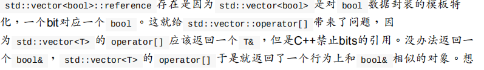

---

不可见的代理类不可以和auto一同使用。

使用显式的类型初始化即可：

```cpp
auto ep=static_cast<float>(calcEpsilon());
```

这样就可以迫使auto推导出你想要的类型。


# 条款7 在创建对象时注意区分()和{}

初始化的方式包括使用**小括号**、**等号**、**大括号**。

- 不可复制对i选哪个(如std::atomic类型的对象)可以采用大括号和小括号来初始化，而不能用"="。

大括号初始化**禁止内建类型之间进行隐式窄化类型转换**。

```cpp
double x,y,z;

int sum1{x+y+z}; //无法通过编译
```

---

- C++规定：任何能够解析为声明的都要解析为声明。

所以可能本来想要以默认初始化方式构造一个对象，结果不小心声明了一个函数。

:point_down:本意是想使用一个没有形参的构造函数声明一个对象。

```cpp
Widget w2();这个语句声明了一个函数
```

所以使用大括号就没有歧义了：

```cpp
Widget w2{};
```

---

在构造函数被调用时，只要形参中没有一个具备std::initializer_list类型，那么大括号和小括号没有区别；如果有的话，那么大括号会优先调用它们。

**空大括号表示的是没有参数，而不是空的std::initializer_list**，所以调用默认构造而不是形参为空的std::initializer_list的构造函数。如果要调用空的std::initializer_list的构造函数，就要用两个大括号，或者将大括号嵌套在小括号内。


# 条款8 优先使用nullptr而不是0或NULL

- 0和NULL都不属于指针类型


# 条款9 优先使用声明别名而不是typedef

- 使用using而不是typedef

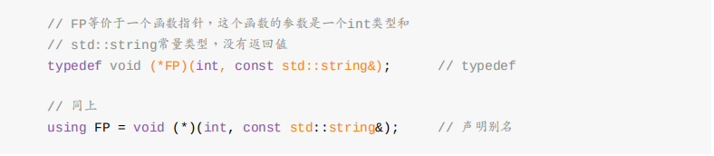

---

在运用模板的地方，typedef就办不到了

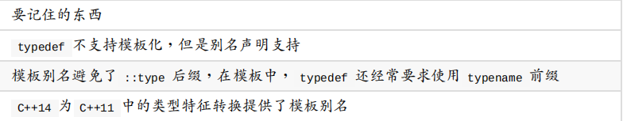


# 条款10 优先使用作用域限制enums而不是无作用域的enum

- 无作用域的enul会将枚举元素隐式的转换为整数类型。

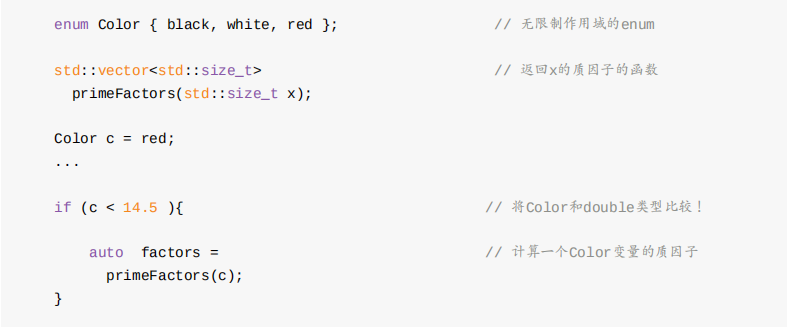

在enum后增加一个"class"，就可以将无作用域的enum转换为一个有作用域的enum。**有作用域的enum不存在从枚举元素到其他类型的隐式转换**。

---

编译器需要在枚举体之前知道它的大小。有作用域的潜在类型是已知的：int；对于没有作用域的枚举体，可以指定。


---

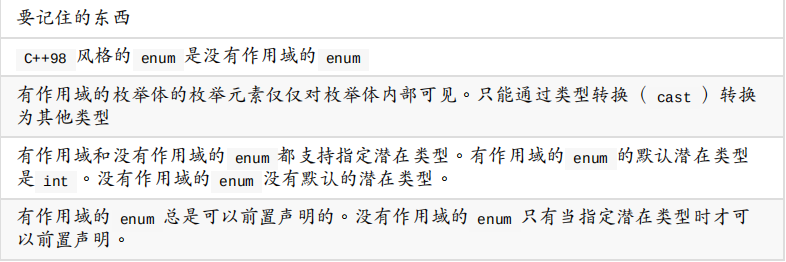


# 条款11 优先使用delete关键字删除函数而不是private却又不实现的函数

删除的函数和声明为私有函数的区别看上去只是时尚一些，但是有很多区别。

- 删除的函数不能通过任何方式被使用，即便是其他成员函数或者友元函数试图复制该对象时也会导致编译失败；而C++98中声明为private这种方式，直到链接的时候才会诊断出这个错误。

---

hint:如果给float一个转换为int或double的可能性，C++总倾向于转换为double。


# 条款12 使用override关键字声明覆盖的函数


# 条款13 优先使用const_iterator而不是iterator

- const_iterator在STL中等价于指向const的指针。


# 条款14 如果函数不抛出异常请使用noexcept

```cpp
int f(int x) throw();	//C++98风格，不抛出异常
int f(int x) noexcept;	//C++11风格，不抛出异常
```

---

C++11中，移动操作会破坏push_back的异常安全保证。如果n个元素已经从老内存去移动到新内存区，但异常在第n+1个元素时抛出，那么push_back就不能完成。但是原始的std::vector已经被修改：有n个元素被移动走了。恢复操作也不太可能，因为从新内存到老内存的移动又可能发生异常。

- 对于移动语义和`swap`非常有用。

---

对于一些允许内存释放(`operator delete`和`operator delete[]`)和析构函数抛出异常是十分糟糕的，需要声明为`noexcept`。所以C++11将它们默认声明为隐式`noexcept`的。


# 条款15 尽可能使用constexpr

- `constexpr`表明一个值不仅仅是常量，还是编译期可知。

编译期可知的值"享有特权"，他们可能被存放的只读存储空间。另一种用法是用于需要"整形常量表达式"的上下文中。

- const不提供constexpr所能保证之事，因为const对象不需要在编译期初始化它的值


---

C++11中，`constexpr`函数的代码不能超过一行：一个`return`语句。但是在C++14被放松了：`constexpr`函数只能获取和返回字面值类型。

---

在C++11中，`constexpr`是隐式`const`的，所以如果作为成员函数，不能修改成员变量。而且`void`返回类型不是字面值类型。

但是在C++14中被放开，setter(赋值器)也能声明为`constexpr`。


# 条款16 让const成员函数线程安全

- `const`不是线程安全的。

`std::mutex`是一种只可移动但不能复制的类型，根据class的规则，类的属性取决于内含元素的属性，所以内含`std::mutex`的class失去了被复制的能力。

---

某些情况下，互斥量的副作用会过大。可以使用`std::atomic`修饰开销会更小。但是它只适合操作单个变量或内存位置。


# 条款17 理解特殊成员函数的生成

- 特殊函数指C++自己生成的函数，仅在需要的时候才生成。

拷贝操作和移动操作一样，如果自己声明了，编译器就不会生成。

---

- 两个拷贝操作是独立的：声明一个不会限制编译器生成另一个。声明一个拷贝构造函数但没有声明拷贝赋值运算符，当代码用到拷贝赋值，编译器会自动生成。反之亦然。
- 两个移动操作并不相互独立。如果声明其中一个，编译器就不会再生成另外一个。


- 如果一个类显式声明了拷贝操作，编译器就不会生成移动操作。解释：如果声明拷贝操作，那么说明平常拷贝对象的方法不适用于该类，编译器会明白：如果逐成员拷贝对拷贝操作来说不合适，逐成员移动也可能不合适。反之亦然，所以可以通过声明移动构造来禁止编译器自动生成拷贝函数。

---

**Rule of Three**：如果声明了拷贝构造函数、拷贝赋值运算符，或者析构函数三者之一，你应该也声明其余两个。用户接管拷贝操作的需求几乎都是因为该类会做其他资源的管理。这也意味着(针对上面的那三个)：

1. 无论哪种资源管理如果在拷贝操作内完成，也应该在另一个拷贝操作内完成。
2. 类的析构函数也需要参与资源的管理(通常是释放)。


所以仅当下面条件成立时才会生成移动操作(当需要时)：

- 类中没有拷贝操作
- 类中没有移动操作
- 类中没有用户定义的析构

---


# 条款18 对于独占资源使用`std::unique_ptr`

- 默认情况下`std::unique_ptr`大小等同于原始指针(row pointer)  **(使用默认删除器)**。

`std::unique_ptr`始终拥有其所指的内容，移动一个`std::unique_ptr`将所有权从源指针转移到目的指针(源指针被设置为nullptr)**拷贝一个`std::unique_ptr`是不允许的**，因为会得到指向相同内容的两个`std::unique_ptr`，每个都认为自己拥有且应当最后销毁资源，就会**double delete**。

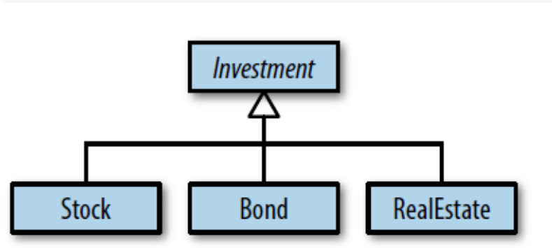

`std::unique_ptr`可以被设置使用**自定义删除器**。

```cpp
auto delInvmt = [](Investment* pInvestment)         //自定义删除器
                {                                   //（lambda表达式）
                    makeLogEntry(pInvestment);
                    delete pInvestment; 
                };

template<typename... Ts>
std::unique_ptr<Investment, decltype(delInvmt)>     //更改后的返回类型
makeInvestment(Ts&&... params)
{
    std::unique_ptr<Investment, decltype(delInvmt)> //应返回的指针
        pInv(nullptr, delInvmt);
    if (/*一个Stock对象应被创建*/)
    {
        pInv.reset(new Stock(std::forward<Ts>(params)...));
    }
    else if ( /*一个Bond对象应被创建*/ )   
    {     
        pInv.reset(new Bond(std::forward<Ts>(params)...));   
    }   
    else if ( /*一个RealEstate对象应被创建*/ )   
    {     
        pInv.reset(new RealEstate(std::forward<Ts>(params)...));   
    }   
    return pInv;
}
```

自定义删除器的一个形参类型是`Investment*`，不管是在`makeInvestment`内部创建的对象的真实类型是什么，最终在lambda表达式中作为`Investment*`对象被删除。这意味着通过基类指针删除派生类实例，基类必须有virtual析构函数。

---

当使用默认删除器时，可以合理假设`std::unique_ptr`对象和原始指针大小相同。当自定义删除器时，函数指针形式的删除器会使`std::unique_ptr`从一个字大小增加到两个。对于函数对象形式的删除器来说，变化的大小取决于函数对象中存储的状态是多少，**无状态函数对象(比如不捕获变量的lambda表达式)对大小没有影响**。

---

`std::unique_ptr`可以灵活的转化为`std::shared_ptr`，所以通常令工厂函数返回`std::unique_ptr`。


# 条款19 对于共享资源使用`std::shared_ptr`

- `std::shared_ptr`通过**引用计数**来确保它是否是最后一个指向某种资源的指针，引用计数关联资源并跟踪有多少`std::shared_ptr`指向该资源。(如果sp1和sp2是`std::shared_ptr`并且指向不同的对象；赋值`sp1=sp2;`会使sp1指向sp2指向的对象。直接效果就是sp1引用计数减1，sp2引用计数加1)

引用计数暗示性能问题：

1. **`std::shared_ptr`大小是原始指针的两倍**。因为内部包含一个指向资源的原始指针，和一个指向资源的引用计数值的原始指针。(这种实现并不是标准要求的，但是大多数标准库都是这么实现的)
2. **引用计数的内存必须动态分配**。引用对象和所指对象关联起来，但是实际上被指的对象不知道这件事情。因此它们无法存放一个引用计数值。
3. **递增递减引用计数必须是原子性的**。

如果使用移动方式构造新的`std::shared_ptr`会将原来的`std::shared_ptr`设置为null。老的`std::shared_ptr`不再指向资源，新的`std::shared_ptr`指向资源。

---

对于`std::unique_ptr`来说，删除器类型是智能指针类型的一部分。对于`std::shared_ptr`则不是：

```cpp
auto loggingDel = [](Widget *pw){
    makeLogEntry(pw);
    delete pw;
}

//删除器类型是指针类型的一部分
std::unique_ptr<Widget,decltype(loggingDel)>upw(new Widget, loggingDel);
//删除器类型不是指针类型的一部分
std::shared_ptr<Widget>spw(new Widget, loggingDel);
```

因为对于`std::shared_ptr`删除器类型不属于智能指针类型，那么不同删除器类型的相同资源`std::shared_ptr`就可以放入同一个容器。

指定删除器不会改变`std::shared_ptr`对象的大小，不管删除器是什么，一个`std::shared_ptr`对象都是两个指针大小。那么删除器消耗的内存在哪呢？

堆！ `std::shared_ptr`对象的引用计数是一个更大的数据结构的一部分，那个数据结构是**控制块**。每个`std::shared_ptr`管理的对象都有个相应的控制块。控制块包含引用计数值和一个**自定义删除器的拷贝**。控制块可能还包含一些额外数据，比如一个次级引用计数weak count。

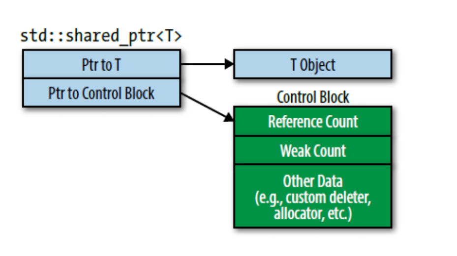

---

当指向对象的 `std::shared_ptr`一创建，对象的控制块就建立了。

- **`std::make_shared`总是创建一个控制块。**他创建一个要指向的新对象，所以可以肯定它调用时对象不存在其他控制块。
- **当从独占指针(即`std::unique_ptr`或者`std::auto_ptr`)上构造出 `std::shared_ptr`时会创建控制块。**独占指针没有控制块。(作为构造的一部分， `std::shared_ptr`侵占独占指针所指向对象的独占权，所以独占指针被设置为nullptr)
- **当从原始指针上构造出 `std::shared_ptr`时候会创建控制块**。如果在一个已经存在控制块的对象上创建 `std::shared_ptr`，不会创建新的控制块。因为在构造的时候可以依赖传递来的智能指针来指向控制块。


所以当从原始指针上构造超过一个 `std::shared_ptr`，就会产生未定义行为。因为指向的对象有多个控制块。**多个控制块意味着多个引用计数值，意味着对象会被销毁多次**(每个引用计数一次)。

---

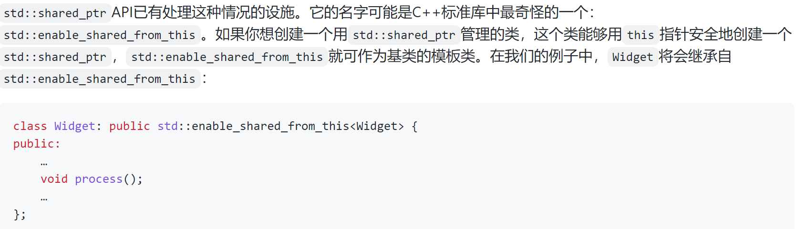

---

`std::shared_ptr`不能处理数组，因为它设计之初就是针对单个对象的。


# 条款20 当`std::shared_ptr`可能悬空时使用`std::weak_ptr`

`std::weak_ptr`不能解引用，也不能测试是否为空值。因为它不是一个独立的智能指针，**它建立在`std::shared_ptr`之上**，但是它不会增加所指对象的引用计数。


# 条款21 优先使用`std::make_unique`和`std::make_shared`而非new

`make_unique`只是把它的参数完美转发到创建对象的构造函数。(`std::forward`)

---

```cpp
void processWidget(std::shared_ptr<Widget> spw,int priority);
```

如果调用时采用`new`而不是`std::make_shared`，会导致潜在的资源泄露：

```cpp
processWidget(std::shared_ptr<Widget>(new Widget),computePriority());
```

在运行时，一个函数的实参必须先被计算，再调用函数。

如果按照这个顺序执行：

1. 执行`new Widget`
2. 执行`computePriority`
3. 运行`std::shared_ptr`构造函数

如果在`computePriority`产生了异常，那么第一步动态分配的Widget就会泄露，它永远不会被第三部的`std::shared_ptr`所管理了。

所以采用`make_shared`可以防止这个问题。

---

`make_shared`也比`new`效率高，因为`std::shared_ptr`指向一个控制块，其中包含引用计数和其他东西。这个控制块在`std::shared_ptr`的构造函数中分配。因此`new`需要为Widget进行一次内存分配，再为控制块进行一次内存分配。而`make_shared`只需要一次。

---

make函数不能自定义删除器。但是`std::shared_ptr`和`std::unique_ptr`的构造函数都支持这么做。

make函数也不能使用花括号初始化。


# 条款22 当使用Pimpl惯用法，在实现文件中定义特殊成员函数

**Pimpl**(pointer to implementation)：将类数据成员替换为一个指向包含具体实现的类的指针，并将放在主类的数据成员们移动到实现类，这些数据成员通过指针间接访问。

---

`std::unique_ptr`的默认删除器是一个函数，使用`delete`销毁内置于智能指针的原始指针。**但是在调用`delete`之前，通常会使默认删除器使用C++11特性`static_assert`来确保原始指针指向的类型不是一个未完成类**。

所以要确保在析构之前出现实现类的完整定义。可以在析构函数后加`=default`。

---

**Hint**：体会分离编译。

`std::shared_ptr`和`std::unique_ptr`在pImpl指针上的表现有区别的原因：他们支持自定义删除器的方式不同。

- 对于`std::shared_ptr`，删除器类型不是智能指针类型的一部分，会让它生成**更大的运行时数据结构**，但是当编译器生成的特殊成员函数被使用的时候，**指向的对象不必是一个完整类型**。
- 对于`std::unique_ptr`，删除器类型是智能指针类型的一部分，让编译器生成**更小的运行时数据机构**，但是编译器生成的特殊成员函数被调用时，**必须是一个已完成类型**。

```cpp
// widget.h
class Widget{
public:
    Widget();
    ~Widget();
    
    Widget(Widget&& rhs);
    Widget& operator=(Widget&& rhs);
    ...
        
private:
    struct Impl;
    std::unique_ptr<Impl> pImpl;
};
```

```cpp
//widget.cpp
#include"widget.h"
#include"gadget.h"
#include<vector>
#include<string>

struct Widget::Impl{
    std::string name;
    std::vector<double> data;
    Gadget g1,g2,g3;
};

Widget::Widget() = default;
Widget::Widget(Widget&& rhs) = default;
Widget& Widget::operator=(Widget&& rhs) = default;
```


# 条款23 理解`std::move`和`std::forward`

- 形参永远是左值，即便它的类型是一个右值引用

```cpp
void f(Widget&& w);
```

**w是左值**。   因为是一个拷贝或者移动的目的地。(个人理解)

对于能否判断一个表达式是否是左值：取地址。如果能就是左值；不能就是右值。

---

`std::move`和`std::forward`在运行时不做任何事情。它们**不产生任何可执行代码**。它们实质上是转换函数(cast)(函数模板)。`std::move`无条件将它的实参转换为右值，`std::forward`只在特定情况满足时进行转换。

```cpp
template<typename T>                            //在std命名空间
typename remove_reference<T>::type&&
    move(T&& param)
{
    using ReturnType =                          //别名声明，见条款9
        typename remove_reference<T>::type&&;

    return static_cast<ReturnType>(param);
}
```

对一个对象使用`std::move`就是告诉编译器，这个对象很适合被移动。

---

移动构造函数只接收一个non-const的右值引用；拷贝构造函数的形参：**lvalue-reference-to-const**，允许被绑定到一个const右值上。

**所以哪怕用了`std::move`也有可能不是使用移动，而是拷贝**。

---

```cpp
void process(const Widget& lvalArg);        //处理左值
void process(Widget&& rvalArg);             //处理右值

template<typename T>                        //用以转发param到process的模板
void logAndProcess(T&& param)
{
    auto now =                              //获取现在时间
        std::chrono::system_clock::now();
    
    makeLogEntry("Calling 'process'", now);
    process(std::forward<T>(param));
}
```

两次调用：

```cpp
logAndProcess(w);               //用左值调用
logAndProcess(std::move(w));    //用右值调用
```


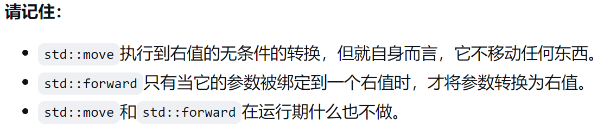


# 条款24 区分通用引用和右值引用

- `T&&`可以是右值引用，也可以是左值引用。

以下两种情况会出现通用引用：

1.函数模板形参

```cpp
template<typename T>
void f(T&& param);                  //param是一个通用引用
```

2.auto声明符

``` cpp
auto&& var2 = var1;                 //var2是一个通用引用
```


**这两种情况都需要类型推导**。

因为通用引用是引用，所以**必须被初始化**，初始值决定了它是右值引用还是左值引用。

```cpp
template<typename T>
void f(T&& param);              //param是一个通用引用

Widget w;
f(w);                           //传递给函数f一个左值；param的类型
                                //将会是Widget&，也即左值引用

f(std::move(w));                //传递给f一个右值；param的类型会是
                                //Widget&&，即右值引用
```

---

只有声明为`T&&`时才是通用引用，其他都不是。**哪怕是一个const修饰符，也会让它失去通用引用资格**。


# 条款25 对右值引用使用`std::move`，对通用引用使用`std::forward`

```cpp
void setName(std::string&& newName){
    name = std::move(newName);
}
```

该版本会导致一个临时`std::string`对象被创建，setName形参绑定到这个对象，然后这个临时对象移动到该class的数据成员中。

---

对要拷贝返回值的右值引用形参使用`std::move`，会将拷贝构造变为移动构造：

```cpp
Matrix operator+(Matrix&& lhs, const Matrix& rhs){
    lhs+=rhs;
    return std::move(lhs);
}
```

但是对于局部变量 不可以！

编译器会在按值返回的函数中消除对局部对象的拷贝(或移动)，如果满足：

1. 局部对象与函数返回值的类型相同。
2. 局部对象就是要返回的东西。

编译器会使用**返回值优化**(RVO)，通过在分配给函数返回值的内存中构造w来避免复制局部变量w。

```cpp
Widget makeWidget(){
    Widget w;
    ...
    return w;
}
```


# 条款26 避免在通用引用上重载

```cpp
std::multiset<std::string> names;           //全局数据结构
void logAndAdd(const std::string& name)
{
    auto now =                              //获取当前时间
        std::chrono::system_clock::now();
    log(now, "logAndAdd");                  //志记信息
    names.emplace(name);                    //把name加到全局数据结构中；
}                                           //emplace的信息见条款42
```

考虑这三个调用：

```cpp
std::string petName("Darla");
logAndAdd(petName);                     //传递左值std::string
logAndAdd(std::string("Persephone"));	//传递右值std::string
logAndAdd("Patty Dog");                 //传递字符串字面值
```

第三种调用形参`name`绑定一个右值，但是是通过"Patty Dog"隐式创建的临时`std::string`变量。就像第二个调用中，`name`被拷贝到`names`中。

可以通过重写`logAndAdd`来提升效率：

```cpp
template<typename T>
void logAndAdd(T&& name)
{
    auto now = std::chrono::system_lock::now();
    log(now, "logAndAdd");
    names.emplace(std::forward<T>(name));
}

std::string petName("Darla");           //跟之前一样
logAndAdd(petName);                     //跟之前一样，拷贝左值到multiset
logAndAdd(std::string("Persephone"));	//移动右值而不是拷贝它
logAndAdd("Patty Dog");                 //在multiset直接创建std::string
                                        //而不是拷贝一个临时std::string
```

---

如果在通用引用上重载了，那么可能调用时不会调用你的重载函数，而是由template推导出的精确匹配的通用引用的那个函数。

```cpp
class Person {
public:
    template<typename T>            //完美转发的构造函数
    explicit Person(T&& n)
    : name(std::forward<T>(n)) {}

    explicit Person(int idx);       //int的构造函数

    Person(const Person& rhs);      //拷贝构造函数（编译器生成）
    Person(Person&& rhs);           //移动构造函数（编译器生成）
    …
};

Person p("Nancy"); 
auto cloneOfP(p);                   //从p创建新Person；这通不过编译！
```

如果以一个const对象调用构造函数，那么就可以匹配到拷贝构造函数而不是完美转发的构造函数了。

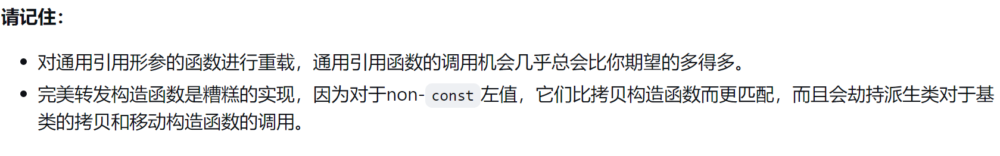


# 条款27 熟悉通用引用重载的替代方法

有点神棍，看不懂...


# 条款28 理解引用折叠

```cpp
template<typename T>
void func(T&& param);

Widget widgetFactory();     //返回右值的函数
Widget w;                   //一个变量（左值）
func(w);                    //用左值调用func；T被推导为Widget&
func(widgetFactory());      //用又值调用func；T被推导为Widget
```

当左值实参传入时，T被推导为**左值引用**；右值被传入时，被推导为**非引用**。

**然而，C++不允许引用的引用**，那么T被推导为左值引用的话，`param`就变成了`Widget& &&`，错！

所以有了**引用折叠**，有四种可能的引用组合(左值的左值，右值的右值，右值的左值，左值的右值)

存在两种类型的引用（左值和右值），所以有四种可能的引用组合（左值的左值，左值的右值，右值的右值，右值的左值）。如果一个上下文中允许引用的引用存在（比如，模板的实例化），引用根据规则**折叠**为单个引用：

> 如果任一引用为左值引用，则结果为左值引用。否则（即，如果引用都是右值引用），结果为右值引用。

---

引用折叠是`std::forward`工作的关键机制。可以这样实现：

```cpp
template<typename T>                                //在std命名空间
T&& forward(typename
                remove_reference<T>::type& param)
{
    return static_cast<T&&>(param);
}
```

C++14可以使用`remove_reference_t<T>`而且不用加`typename`了。

---

通用引用并不是一种新引用，它实际上是满足以下两个条件的右值引用：

- 类型推导区分左值和右值。 **T类型左值被推导为T&，T类型右值被推导为T**

- 发生引用折叠。


# 条款29 认识移动操作的缺点

C++只会在没有声明复制操作，移动操作，或析构函数的类中才会自动生成移动操作。

---

`std::array`是C++11的新容器。`std::array`本质上是具有STL接口的内置数组，与其他标准容器将内容存储在堆内存中不同。**存储具体数据在堆内存的容器，本身只保存了指向堆内存中容器内容的指针**。这个指针的存在使得在常数时间移动整个容器成为可能。只需要从源容器拷贝保存指向容器内容的指针到目标容器，然后将源指针置为空指针就可以了。

```cpp
std::vector<Widget> vm1;

//把数据存进vw1
…

//把vw1移动到vw2。以常数时间运行。只有vw1和vw2中的指针被改变
auto vm2 = std::move(vm1);
```

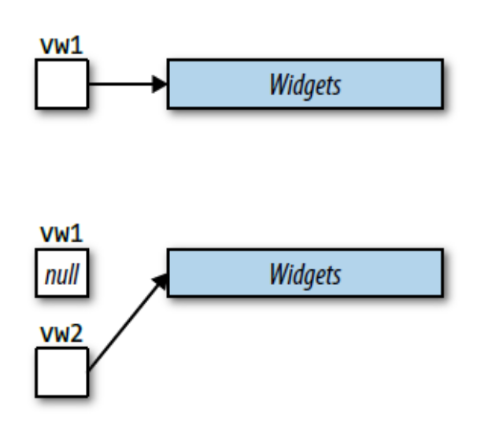

`std::array`没有这种指针实现，数据就保存在该对象中：

```cpp
std::array<Widget, 10000> aw1;

//把数据存进aw1
…

//把aw1移动到aw2。以线性时间运行。aw1中所有元素被移动到aw2
auto aw2 = std::move(aw1);
```

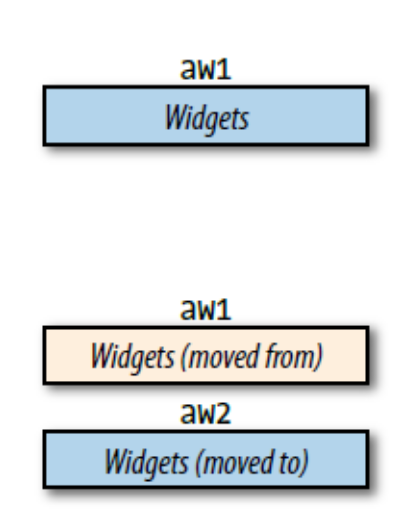

---

另一方面，`std::string`提供了常数时间的移动操作和线性时间的复制操作。这听起来移动比复制快多了，但是可能不一定。许多字符串的实现采用了**小字符串优化**（*small string optimization*，SSO）。“小”字符串（比如长度小于15个字符的）存储在了`std::string`的缓冲区中，并没有存储在堆内存，移动这种存储的字符串并不必复制操作更快。

**Hint**：今天才看到Cherno的一条弹幕说的SSO


# 条款30 熟悉完美转发失败的情况

对于通常的转发来说，我们希望处理**引用形参**，而不是**值传递形参和指针形参**。

完美转发模板：

```cpp
template<typename T>
void fwd(T&& param)             //接受任何实参
{
    f(std::forward<T>(param));  //转发给f
}
```

---

如果`f`使用某特定实参会执行某个操作，但是`fwd`使用相同的实参会执行不同的操作，完美转发就会失败。


> 花括号初始化器

假设`f`这样定义：

```cpp
void f(const std::vector<int>& v);
f({ 1, 2, 3 });         //可以，“{1, 2, 3}”隐式转换为std::vector<int>
fwd({ 1, 2, 3 });       //错误！不能编译
```

在对`f`的**直接**调用上，编译器会观察传入的实参并和形参比较，看看是否匹配，必要时执行隐式转换使得调用成功。此处会生成一个临时`std::vector<int>`对象。

当通过函数模板`fwd`**间接**调用`f`时，编译器不再把传入给fwd的实参和`f`声明中的形参类型作比较，而是**推导**传入给`fwd`的实参类型。此处由于模板的规则：**模板类型推导无法推导出列表初始化**，所以直接无法编译了。


> 0或者NULL作为空指针

[Item8](https://github.com/kelthuzadx/EffectiveModernCppChinese/blob/master/3.MovingToModernCpp/item8.md)说明当你试图传递`0`或者`NULL`作为空指针给模板时，类型推导会出错，会把传来的实参推导为一个整型类型（典型情况为`int`）而不是指针类型。结果就是不管是`0`还是`NULL`都不能作为空指针被完美转发。解决方法非常简单，传一个`nullptr`而不是`0`或者`NULL`。


> 仅有声明的整形`static const`数据成员

**在二进制底层代码中，指针和引用是一样的。在这个水平上，引用是可以自动接引用的指针**。

为了使用完美转发，需要为整形`static const`数据成员提供一个定义：

```cpp
const std::size_t Widget::MinVals;  //在Widget的.cpp文件
```

[参考网页]: https://www.cnblogs.com/stevenshen123/p/11555758.html#:~:text=%E5%A6%82%E6%9E%9C%E4%B8%80%E4%B8%AA%E7%B1%BB%E5%86%85%E6%88%90%E5%91%98%E5%8F%98%E9%87%8F%E6%98%AFstatic%E7%9A%84%EF%BC%8C%E4%B8%94%E9%9C%80%E8%A6%81%E5%B0%86%E4%B9%8B%E8%AE%BE%E5%AE%9A%E4%B8%BA%E5%B8%B8%E9%87%8F,%28const%29%EF%BC%8C%E9%82%A3%E4%B9%88%E8%BF%99%E4%B8%AA%E5%8F%98%E9%87%8F%E5%A3%B0%E6%98%8E%E4%B8%8E%E5%88%9D%E5%A7%8B%E5%8C%96%E5%9D%87%E5%8F%AF%E5%86%99%E5%9C%A8%E5%A4%B4%E6%96%87%E4%BB%B6%E5%86%85%E3%80%82

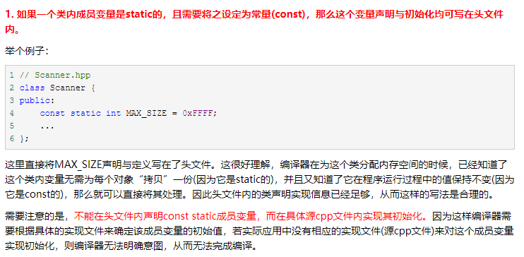

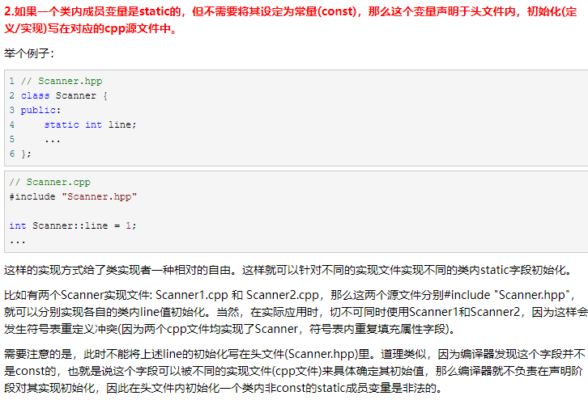

此处需要的情况是第一个:point_up_2:。


> 重载函数的名称和模板名称

```cpp
void f(int (*pf)(int));             //pf = “process function”

int processVal(int value);
int processVal(int value, int priority);

f(processVal);                      //可以
fwd(processVal);                    //错误！哪个processVal？
```

可以创造一个与`f`相同形参类型的函数指针，然后**引导**选择正确的版本：

```cpp
using ProcessFuncType =                         //写个类型定义；见条款9
    int (*)(int);

ProcessFuncType processValPtr = processVal;     //指定所需的processVal签名

fwd(processValPtr);                             //可以
fwd(static_cast<ProcessFuncType>(workOnVal));   //也可以
```


> 位域

感觉不堪大用。


# Lambda表达式

- lambda表达式：

```cpp
std::find_if(container.begin(), container.end(),
             [](int val){ return 0 < val && val < 10; });   //译者注：本行高亮
```

- 闭包：是lambda创建的运行时对象。依赖捕获模式，闭包持有背部或数据的副本或者引用。在上面的`std::find_if`调用中，闭包事作为第三个实参在**运行时**传递给`std::find_if`对象。
- 闭包类：是从中实例化闭包的类。每个lambda都会使编译器生成唯一的闭包类。*lambda*中的语句成为其闭包类的成员函数中的可执行指令。

闭包通常可以靠诶，所以可能有多个闭包对应于一个lambda


# 条款31 避免使用默认捕获模式

> 按引用捕获会导致闭包中包含对某个局部变量或者形参的引用，变量或形参只在定义lambda的作用域中可见

如果lambda创建的闭包生命周期长过局部变量或形参的生命周期，那么闭包中的引用将变成**悬空引用**。

```cpp
using FilterContainer =                     //“using”参见条款9，
	std::vector<std::function<bool(int)>>;  //std::function参见条款2

FilterContainer filters;                    //过滤函数

void addDivisorFilter()
{
    auto calc1 = computeSomeValue1();
    auto calc2 = computeSomeValue2();

    auto divisor = computeDivisor(calc1, calc2);

    filters.emplace_back(                               //危险！对divisor的引用
        [&](int value) { return value % divisor == 0; } //将会悬空！
    );
}
```

lambda对局部变量`divisor`进行引用，但是该变量的生命周期会在函数返回时结束。


> 使用拷贝捕获，但如果遇到指针。并不能避免lambda外对这个指针的`delete`，导致副本指针变成悬空指针

---

捕获只能应用于`lambda`被创建的时候所在作用域里的`non-static`局部变量(包括形参)。

```cpp
class Widget {
public:
    …                       //构造函数等
    void addFilter() const; //向filters添加条目
private:
    int divisor;            //在Widget的过滤器使用
};

void Widget::addFilter() const
{
    filters.emplace_back(
        [=](int value) { return value % divisor == 0; }
    );
}	
```

这里没有捕获到`divisor`，而是一个**this指针**，在任何Widget成员函数中，对成员变量的访问都会隐式地使用this->val。


在C++14中一个更好的捕获成员变量的方式是使用通用的lambda捕获：

```cpp
void Widget::addFilter() const
{
    filters.emplace_back(                   //C++14：
        [divisor = divisor](int value)      //拷贝divisor到闭包
        { return value % divisor == 0; }	//使用这个副本
    );
}
```


使用默认的按值捕获，它们预示了相关的闭包是独立的并且不受外部数据变化的影响。

> 静态存储生命周期对象(static)也可以在lambda中使用，但是不能被捕获，而是直接使用。


# 条款32 使用初始化捕获来移动对象到闭包中

C++11不支持移动对象到闭包中，但是C++14支持。(**初始化捕获**)

使用初始化捕获可以指定：

- 从lambda生成的闭包类中的数据成员名称
- 初始化该成员的表达式

```cpp
class Widget {                          //一些有用的类型
public:
    …
    bool isValidated() const;
    bool isProcessed() const;
    bool isArchived() const;
private:
    …
};

auto pw = std::make_unique<Widget>();   //创建Widget；使用std::make_unique
                                        //的有关信息参见条款21

…                                       //设置*pw

auto func = [pw = std::move(pw)]        //使用std::move(pw)初始化闭包数据成员
            { return pw->isValidated()
                     && pw->isArchived(); };
```

捕获部分的表达式`pw = std::move(pw)`，等号左侧的作用域是闭包类，右侧作用域和lambda定义所在的定义域相同。

---

如果在C++11中没有**初始化捕获**，可以使用`std::bind`，而且将捕获转变为参数：

```cpp
auto func = std::bind(
                [](const std::unique_ptr<Widget>& pw)
                { return pw->isValidated()
                         && pw->isArchived(); },
                std::make_unique<Widget>()
            );
```


# 条款33 对`auto&&`形参使用`decltype`以`std::forward`它们

在**泛型lambda中**如果碰到类似：

```cpp
auto f = [](auto&& x)
         { return func(normalize(std::forward<???>(x))); };
```

`forward`后面的尖括号中应该填什么？   因为lambda没有模板，所以没有不能填诸如T的类型。

传递给通用引用的是左值，形参会变为左值引用；右值，会变为右值引用。所以可以通过使用`decltype`来检查传入实参是左值还是右值。

因此，lambda的完美转发可以写成：

```cpp
auto f =
    [](auto&& param)
    {
        return
            func(normalize(std::forward<decltype(param)>(param)));
    };
```


# 条款34 考虑lambda而非`std::bind`

略......


# 条款35 优先选用基于任务而非基于线程的程序设计

如果开发者想异步执行`doAsyncWork`函数，通常有两种方式：

- 通过创建`std::thread`执行，**基于线程**：

```cpp
int doAsyncWork();

std::thread t(doAsyncWork);
```

- 将`doAsyncWork`传递给std::async，**基于任务**：

```cpp
auto fut = std::async(doAsyncWork);  //fut是一个future类型的变量
```

这种方式中，传递给`std::async`的函数对象被称为一个**任务**。


基于任务的方法通常比基于线程的方法更优，原因之一上面的代码已经表明，基于任务的方法代码量更少。我们假设调用`doAsyncWork`的代码对于其提供的返回值是有需求的。基于线程的方法对此无能为力，而基于任务的方法就简单了，因为`std::async`返回的*future*提供了`get`函数（从而可以获取返回值）。如果`doAsycnWork`发生了异常，`get`函数就显得更为重要，因为`get`函数可以提供抛出异常的访问，而基于线程的方法，如果`doAsyncWork`抛出了异常，程序会直接终止（通过调用`std::terminate`）。


C++的thread有三种含义：

- **硬件线程**（hardware threads）是真实执行计算的线程。现代计算机体系结构为每个CPU核心提供一个或者多个硬件线程。
- **软件线程**（software threads）（也被称为系统线程（OS threads、system threads））是操作系统（假设有一个操作系统。有些嵌入式系统没有。）管理的在硬件线程上执行的线程。通常可以存在比硬件线程更多数量的软件线程，因为当软件线程被阻塞的时候（比如 I/O、同步锁或者条件变量），操作系统可以调度其他未阻塞的软件线程执行提供吞吐量。
- **`std::thread`** 是C++执行过程的对象，并作为软件线程的句柄（*handle*）。有些`std::thread`对象代表“空”句柄，即没有对应软件线程，因为它们处在默认构造状态（即没有函数要执行）；有些被移动走（移动到的`std::thread`就作为这个软件线程的句柄）；有些被`join`（它们要运行的函数已经运行完）；有些被`detach`（它们和对应的软件线程之间的连接关系被打断）。


如果试图创建大于系统支持的线程数量，会抛出`std::system_error`异常。


即使没有超出软件线程的限额，仍然可能会遇到**资源超额**（*oversubscription*）的麻烦。这是一种当前准备运行的（即未阻塞的）软件线程大于硬件线程的数量的情况。情况发生时，线程调度器（操作系统的典型部分）会将软件线程时间切片，分配到硬件上。当一个软件线程的时间片执行结束，会让给另一个软件线程，此时发生上下文切换。软件线程的上下文切换会增加系统的软件线程管理开销，当软件线程安排到与上次时间片运行时不同的硬件线程上，这个开销会更高。这种情况下，（1）CPU缓存对这个软件线程很冷淡（即几乎没有什么数据，也没有有用的操作指南）；（2）“新”软件线程的缓存数据会“污染”“旧”线程的数据，旧线程之前运行在这个核心上，而且还有可能再次在这里运行。


```cpp
auto fut = std::async(doAsyncWork);
```

这种调用方式将线程管理交给了标准库。它使用默认启动策略，允许通过调度器将特定函数运行在**等待此函数结果的线程上**(即在对fut调用get或者wait的线程上)。


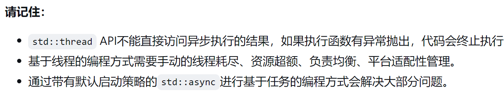


# 条款36 如果有异步的必要请指定`std::launch::async`

`std::launch`有两种启动策略，都通过`std::launch`这个限域enum的一个枚举名来表示。

- **`std::launch::async`启动策略**意味着`f`必须异步执行，即在不同的线程。
- **`std::launch::deferred`启动策略**意味着`f`仅当在`std::async`返回的*future*上调用`get`或者`wait`时才执行。这表示`f`**推迟**到存在这样的调用时才执行（译者注：异步与并发是两个不同概念，这里侧重于惰性求值）。当`get`或`wait`被调用，`f`会同步执行，即调用方被阻塞，直到`f`运行结束。如果`get`和`wait`都没有被调用，`f`将不会被执行。（这是个简化说法。关键点不是要在其上调用`get`或`wait`的那个*future*，而是*future*引用的那个共享状态。（[Item38](https://github.com/kelthuzadx/EffectiveModernCppChinese/blob/master/7.TheConcurrencyAPI/item38.md)讨论了*future*与共享状态的关系。）因为`std::future`支持移动，也可以用来构造`std::shared_future`，并且因为`std::shared_future`可以被拷贝，对共享状态——对`f`传到的那个`std::async`进行调用产生的——进行引用的*future*对象，有可能与`std::async`返回的那个*future*对象不同。这非常绕口，所以经常回避这个事实，简称为在`std::async`返回的*future*上调用`get`或`wait`。）


如果不显式指定策略的话，默认的启动策略并不是上述的任意一个，而是|的关系

```cpp
auto fut = std::async(f);   //使用默认启动策略运行f
```

- **无法预测`f`是否会与`t`并发运行**，因为`f`可能被安排延迟运行。
- **无法预测`f`是否会在与某线程相异的另一线程上执行，这个某线程在`fut`上调用`get`或`wait`**。如果对`fut`调用函数的线程是`t`，含义就是无法预测`f`是否在异于`t`的另一线程上执行。
- **无法预测`f`是否执行**，因为不能确保在程序每条路径上，都会不会在`fut`上调用`get`或者`wait`。


默认启动策略的调度灵活性导致使用`thread_local`变量比较麻烦，如果`f`读取了线程本地存储，不能预测到哪个线程的变量被访问：

```cpp
auto fut = std::async(f);   //f的TLS可能是为单独的线程建的，
                            //也可能是为在fut上调用get或者wait的线程建的
```


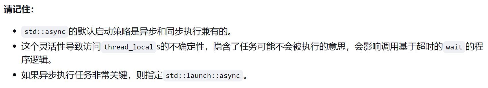


# 条款37 使`std::thread`在所有路径最后都不可结合

每个`std::thread`对象处于两个状态之一：**可结合的**（*joinable*）或者**不可结合的**（*unjoinable*）。

可结合状态的`std::thread`对应于正在运行或者可能要运行的异步执行线程。

不可结合的`std::thread`对象包括：

- **默认构造的`std::thread`s**。这种`std::thread`没有函数执行，因此没有对应到底层执行线程上。
- **已经被移动走的`std::thread`对象**。移动的结果就是一个`std::thread`原来对应的执行线程现在对应于另一个`std::thread`。
- **已经被`join`的`std::thread`** 。在`join`之后，`std::thread`不再对应于已经运行完了的执行线程。
- **已经被`detach`的`std::thread`** 。`detach`断开了`std::thread`对象与执行线程之间的连接。


可结合的`std::thread`析构会终止程序。C++委员会认为销毁可结合的线程的后果非常严重：

- **隐式`join`** 。这种情况下，`std::thread`的析构函数将等待其底层的异步执行线程完成。这听起来是合理的，但是可能会导致难以追踪的异常表现。比如，如果`conditonAreStatisfied()`已经返回了`false`，`doWork`继续等待过滤器应用于所有值就很违反直觉。

- **隐式`detach`** 。这种情况下，`std::thread`析构函数会分离`std::thread`与其底层的线程。底层线程继续运行。听起来比`join`的方式好，但是可能导致更严重的调试问题。比如，在`doWork`中，`goodVals`是通过引用捕获的局部变量。它也被*lambda*修改（通过调用`push_back`）。假定，*lambda*异步执行时，`conditionsAreSatisfied()`返回`false`。这时，`doWork`返回，同时局部变量（包括`goodVals`）被销毁。栈被弹出，并在`doWork`的调用点继续执行线程。

  调用点之后的语句有时会进行其他函数调用，并且至少一个这样的调用可能会占用曾经被`doWork`使用的栈位置。我们调用那么一个函数`f`。当`f`运行时，`doWork`启动的*lambda*仍在继续异步运行。该*lambda*可能在栈内存上调用`push_back`，该内存曾属于`goodVals`，但是现在是`f`的栈内存的某个位置。这意味着对`f`来说，内存被自动修改了！想象一下调试的时候“乐趣”吧。


所以要自行保证`std::thread`在离开作用域时是不可结合的。**最通用的办法就是将该操作放入局部对象的析构函数中：

```cpp
class ThreadRAII {
public:
    enum class DtorAction { join, detach };     //enum class的信息见条款10
    
    ThreadRAII(std::thread&& t, DtorAction a)   //析构函数中对t实行a动作
    : action(a), t(std::move(t)) {}

    ~ThreadRAII()
    {                                           //可结合性测试见下
        if (t.joinable()) {
            if (action == DtorAction::join) {
                t.join();
            } else {
                t.detach();
            }
        }
    }

    std::thread& get() { return t; }            //见下

private:
    DtorAction action;
    std::thread t;
};
```

该构造器只支持`std::thread`右值，因此要移动进来(因为`std::thread`不可以复制)。


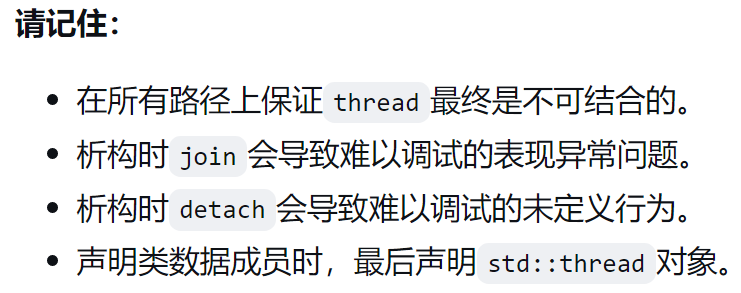


# 条款38 关注不同线程句柄的析构行为

因为与被调用者关联的对象和与调用者关联的对象都不适合存储**被调用者的结果**，所以必须存储在两者之外的**共享状态**。通常是基于堆的对象。


共享状态的存在非常重要，因为*future*的析构函数取决于与*future*关联的共享状态：

- **引用了共享状态——使用`std::async`启动的未延迟任务建立的那个——的最后一个future的析构函数会阻塞住**，直到任务完成。本质上，这种*future*的析构函数对执行异步任务的线程执行了隐式的`join`。
- **其他所有future的析构函数简单地销毁future对象**。对于异步执行的任务，就像对底层的线程执行`detach`。对于延迟任务来说如果这是最后一个*future*，意味着这个延迟任务永远不会执行了。


# 条款39 对于一次性事件通信考虑使用`void`的*futures*

没看懂...


# 条款40 对于并发使用`std::atomic`，对于特殊内存使用`volatile`

- 一旦`std::atomic`对象被构建，其上的操作表现的像操作是在互斥锁保护的关键区内。

```cpp
std::atomic<int> ai(0);         //初始化ai为0
ai = 10;                        //原子性地设置ai为10
std::cout << ai;                //原子性地读取ai的值
++ai;                           //原子性地递增ai到11
--ai;                           //原子性地递减ai到10
```


> volatile 是告诉编译器**不要对这块内存执行任何优化**。

```cpp
volatile int x;
auto y = x;                             //读x
y = x;                                  //再次读x（不会被优化掉）

x = 10;                                 //写x（不会被优化掉）
x = 20;                                 //再次写x
```


---

`std::atomic`的拷贝和移动操作都被禁止了。所以要使用`std::atomic`的`load`和`store`成员函数。`load`原子性的读取，`store`原子性的写入。

```cpp
std::atomic<int> x(10);

std::atomic<int> y(x.load());           //读x
y.store(x.load());                      //再次读x
```


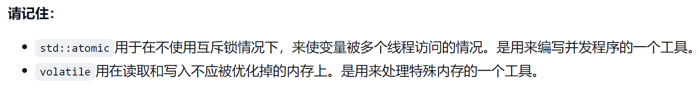


# 条款41 对于移动成本低且总是被拷贝的可拷贝形参，考虑按值传递

```cpp
class Widget {
public:
    void addName(std::string newName) {         //接受左值或右值；移动它
        names.push_back(std::move(newName));
    }
    …
}
```

由于是值传递，所以生成了一个副本，移动它没有后果。

在C++98中，无论调用者传递什么，形参`addName`都是拷贝出来，但是在C++11中，只有在左值实参时，才是拷贝来的；对于右值，使用移动构造。


- 按值传递应该仅考虑那些**移动开销小**的形参。当移动的开下较低，额外的一次移动才能被开发者接受。
- 应该只对**总是被拷贝**的形参考虑按值传递。


使用通过赋值拷贝一个形参进行按值传递的函数的额外开销，取决于传递的类型，左值和右值的比例，这个类型是否需要动态分配内存，以及，如果需要分配内存的话，赋值操作符的具体实现，还有赋值目标占的内存至少要跟赋值源占的内存一样大。对于`std::string`来说，开销还取决于实现是否使用了小字符串优化(SSO)，如果是，那么要赋值的值是否匹配SSO缓冲区。


# 条款42 考虑使用置入代替插入

如果有一个存放`std::string`的容器，通过插入函数添加新元素的时候，传入的元素类型应该是`std::string`：

```cpp
std::vector<std::string> vs;        //std::string的容器
vs.push_back("xyzzy");              //添加字符串字面量
```

此处试图给容器添加一个*字符串字面量*，并不是一个`std::string`

在

```cpp
vs.push_back("xyzzy");
```

中，编译器看到实参类型(`const char[6]`)和形参类型(`std::string`的引用)之间不匹配。所以从字符串字面量创建一个`std::string`类型的临时对象消除不匹配(类似这样)：

```cpp
vs.push_back(std::string("xyzzy")); //创建临时std::string，把它传给push_back
```

1. 一个`std::string`的临时对象从字面量“`xyzzy`”被创建。这个对象没有名字，我们可以称为`temp`。`temp`的构造是第一次`std::string`构造。因为是临时变量，所以`temp`是右值。
2. `temp`被传递给`push_back`的右值重载函数，绑定到右值引用形参`x`。在`std::vector`的内存中一个`x`的副本被创建。这次构造——也是第二次构造——在`std::vector`内部真正创建一个对象。（将`x`副本拷贝到`std::vector`内部的构造函数是移动构造函数，因为`x`在它被拷贝前被转换为一个右值，成为右值引用。
3. 在`push_back`返回之后，`temp`立刻被销毁，调用了一次`std::string`的析构函数。


> 使用`emplace_back`函数

完美转发，没有临时变量产生，而是直接在容器内构造一个对象：

```cpp
vs.emplace_back("xyzzy");           //直接用“xyzzy”在vs内构造std::string
```

插入函数接收**对象**去插入；而置入函数接收**对象的构造函数接受的实参**去插入：

置入函数支持如下的操作：

```cpp
vs.emplace_back(50, 'x');           //插入由50个“x”组成的一个std::string
```

---

满足下列条件时，置入操作会优于插入操作：

- 值是通过构造函数添加到容器，而不是直接赋值。
- 传递的实参类型与容器的初始化类型不同。因为容器不需要构造临时对象。
- 容器不拒绝重复项作为新值。如果值已经存在，那么置入操作取消，创建的节点被销毁，意味着构造和析构的开销被浪费了。


在C++中：

```cpp
std::regex r1 = nullptr;                 //错误！不能编译
std::regex r2(nullptr);                  //可以编译
```

使用等号的(r1)初始化是**拷贝初始化**，使用小括号(r2)初始化是**直接初始化**。

```cpp
using regex   = basic_regex<char>;

explicit basic_regex(const char* ptr,flag_type flags); //定义 (1)explicit构造函数

basic_regex(const basic_regex& right); //定义 (2)拷贝构造函数
```

**拷贝初始化不被允许使用`explicit`构造函数**（即没法调用相应类的`explicit`拷贝构造函数）：对于`r1`,使用赋值运算符定义变量时将调用拷贝构造函数`定义 (2)`，其形参类型为`basic_regex&`。因此`nullptr`首先需要隐式装换为`basic_regex`。而根据`定义 (1)`中的`explicit`，这样的隐式转换不被允许，从而产生编译时期的报错。**对于直接初始化，编译器会自动选择与提供的参数最匹配的构造函数**，即`定义 (1)`。就是初始化`r1`不能编译，而初始化`r2`可以编译的原因。


> 拷贝初始化不允许使用explicit构造函数

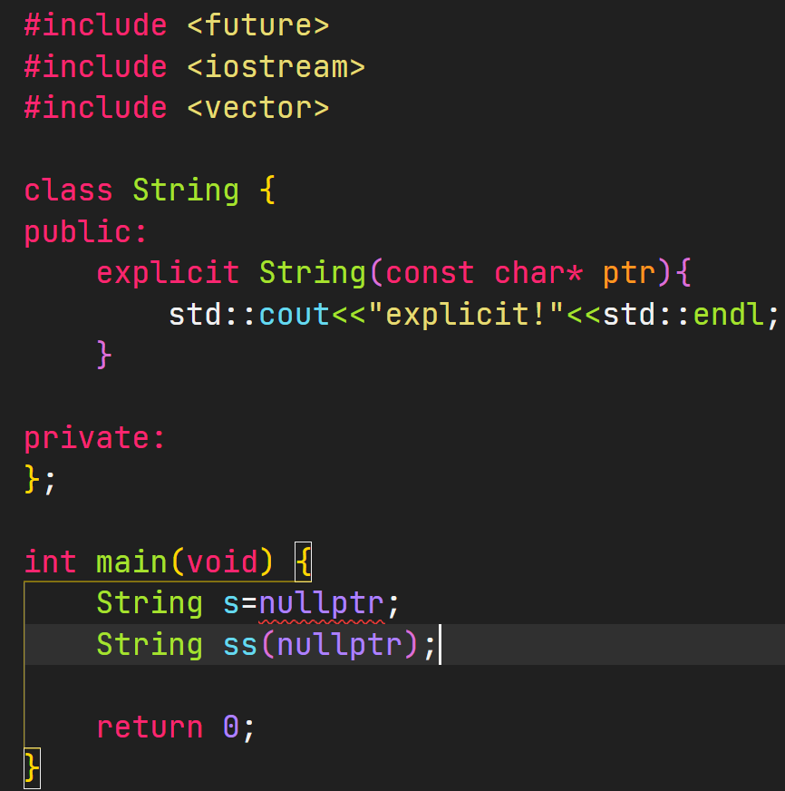
