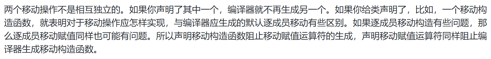

# 条款1 理解模板类型推导

```cpp
template<typename　T>
void f(ParamType param);

f(expr);   //调用
```

通常ParamType包含一些类型的装饰，比如const或引用特性。

---

- 第一种情况：ParamType是个非通用的引用或者是一个指针

1.如果expr的类型是引用，忽略引用的部分

2.利用expr的类型和ParamType对比去判断T的类型

```cpp
template<typename T>
void f(T& param); // param是一个引用类型

int x = 27; // x是一个int
const int cx = x; // cx是一个const int
const int& rx = x; // rx是const int的引用

f(x); 	// T是int，param的类型是int&
f(cx); 	// T是const int， 
		// param的类型是const int&
f(rx); 	// T是const int
		// param的类型时const int&
```

---

- 第二种情况：ParamType是个通用的引用(通用的引用参数声明类型是T&&右值引用)


如果expr是左值，T和ParamType都会被推到成坐直引用

如果expr是右值，执行普通法则(第一种情况)

```cpp
template<typename T>
void f(T&& param); // param现在是一个通用的引用

int x = 27; 
const int cx = x;
const int& rx = x;

f(x); 	// x是左值，所以T是int&
		// param的类型也是int&

f(cx); 	// cx是左值，所以T是const int&
		// param的类型也是const int&

f(rx); 	// rx是左值，所以T是const int&
		// param的类型也是const int&

f(27); 	// 27是右值，所以T是int 
		// 所以param的类型是int&&
```

---

- 第三种情况：ParamType既不是指针也不是引用(pass-by-value)

意味着param就是expr的一份拷贝——一个完全新的对象

1.如果expr的类型是引用，将会忽略引用的部分

2.如果在忽略expr的引用特性，exr是个const的，也要忽略const(volatile也要忽略)

```cpp
template<typename T>
void f(T param); // param现在是pass-by-value

int x = 27;
const int cx = x;
const int& rx = x;

f(x); // T和param的类型都是int
f(cx); // T和param的类型也都是int
f(rx); // T和param的类型还都是int
```

如果传递的是一个const char* const参数，那么经过拷贝后，指针本身的const特性将消失，只剩下对象的const特性，即**被推导为const char*，指针可以指向不同之物**

---


# 条款2 理解auto类型推导

**auto类型推导就是模板类型推导，auto相当于模板中的T**

---

**例外**：对待花括号初始化的行为

```cpp
auto x1 = 27; // 类型是int，值是27
auto x2(27); // 同上

auto x3 = { 27 }; // 类型是std::intializer_list<int> // 值是{ 27 }
auto x4{ 27 }; // 同上
```

当使用一对花括号来初始化一个auto类型变量时，推导的类型是std::intializer_list。**这一点导致花括号和auto容易被误用**

---

C++14允许auto作为函数返回值和lambda参数，但是其实是复用了模板的类型推导，然而**模板并不能将花括号初始化推导为std::intializer_list**，所以返回一个花括号初始化会无法编译。


# 条款3 理解decltype

- 给定一个变量名或表达式，decltype会告诉你它的类型

decltype的推导规则和auto、模板的规则不一样，是什么就返回什么

**auto作为返回值的时候会剥离对象的引用特性，所以返回decltype(auto)**

---

对于一个变量名，decltype返回左值，对于一个比变量名更复杂的左值表达式，**decltype返回左值引用**

```cpp
int x=0;
```


# 条款4 知道如何查看类型推导

- std::type_info::name的特化指定了类型会被当做他们传递给模板函数的时候**值传递**的参数

所以typeid有时候并不可靠


# 条款5 优先使用auto而非显式类型声明

- auto变量从它们的初始化推导出其类型，所以auto变量必须初始化；从而避免了普通声明忘记初始化。

---

- 使用std::function和使用auto不一样。

使用auto声明持有一个封装的变量和函数对象有同样的类型，也今消耗和函数对象同样大小的内存；

使用std::function持有一个可调用对象的变量类型是std::function模板的一个实例，并且对任何类型只有一个固定的大小。这个大小可能不满足需求，所以会开辟堆空间。结果就是**std::function可能比auto对象使用更多内存**。

此外，由于实现细节中，约束内嵌的使用和提供间接函数的调用，使用std::function对象会比auto要慢。

---

```cpp
std::unordered_map<std::string, int> m;
...
for(const std::pair<std::string, int>& p:m){
    ...
}
```

**std::unordered_map中key部分是const类型的**，所以pair的实际类型应该是 

**std::pair<const std::sting, int>**

而且此处不是循环体外的变量p声明，所以编译器会将std::pair<const std::sting, int>转换为std::pair<std::sting, int>。这个过程通过**复制m中的一个元素到一个临时对象，然后将这个临时对象和p绑定**。


# 条款6 当auto推导出非预期类型时应当使用显式的类型初始化

- 对std::vector<bool>的operator[]运算符不一定返回容器中的元素引用(它对所有类型都返回引用，就是除了bool)。

事实上，返回的是一个std::vector<bool>::reference对象(是一个在(std::vector<bool>内嵌的class)。


---

不可见的代理类不可以和auto一同使用。

使用显式的类型初始化即可：

```cpp
auto ep=static_cast<float>(calcEpsilon());
```

这样就可以迫使auto推导出你想要的类型。


# 条款7 在创建对象时注意区分()和{}

初始化的方式包括使用**小括号**、**等号**、**大括号**。

- 不可复制对i选哪个(如std::atomic类型的对象)可以采用大括号和小括号来初始化，而不能用"="。

大括号初始化**禁止内建类型之间进行隐式窄化类型转换**。

```cpp
double x,y,z;

int sum1{x+y+z}; //无法通过编译
```

---

- C++规定：任何能够解析为声明的都要解析为声明。

所以可能本来想要以默认初始化方式构造一个对象，结果不小心声明了一个函数。

:point_down:本意是想使用一个没有形参的构造函数声明一个对象。

```cpp
Widget w2();这个语句声明了一个函数
```

所以使用大括号就没有歧义了：

```cpp
Widget w2{};
```

---

在构造函数被调用时，只要形参中没有一个具备std::initializer_list类型，那么大括号和小括号没有区别；如果有的话，那么大括号会优先调用它们。

**空大括号表示的是没有参数，而不是空的std::initializer_list**，所以调用默认构造而不是形参为空的std::initializer_list的构造函数。如果要调用空的std::initializer_list的构造函数，就要用两个大括号，或者将大括号嵌套在小括号内。


# 条款8 优先使用nullptr而不是0或NULL

- 0和NULL都不属于指针类型


# 条款9 优先使用声明别名而不是typedef

- 使用using而不是typedef


---

在运用模板的地方，typedef就办不到了


# 条款10 优先使用作用域限制enums而不是无作用域的enum

- 无作用域的enul会将枚举元素隐式的转换为整数类型。


在enum后增加一个"class"，就可以将无作用域的enum转换为一个有作用域的enum。**有作用域的enum不存在从枚举元素到其他类型的隐式转换**。

---

编译器需要在枚举体之前知道它的大小。有作用域的潜在类型是已知的：int；对于没有作用域的枚举体，可以指定。


---


# 条款11 优先使用delete关键字删除函数而不是private却又不实现的函数

删除的函数和声明为私有函数的区别看上去只是时尚一些，但是有很多区别。

- 删除的函数不能通过任何方式被使用，即便是其他成员函数或者友元函数试图复制该对象时也会导致编译失败；而C++98中声明为private这种方式，直到链接的时候才会诊断出这个错误。

---

hint:如果给float一个转换为int或double的可能性，C++总倾向于转换为double。


# 条款12 使用override关键字声明覆盖的函数


# 条款13 优先使用const_iterator而不是iterator

- const_iterator在STL中等价于指向const的指针。


# 条款14 如果函数不抛出异常请使用noexcept

```cpp
int f(int x) throw();	//C++98风格，不抛出异常
int f(int x) noexcept;	//C++11风格，不抛出异常
```

---

C++11中，移动操作会破坏push_back的异常安全保证。如果n个元素已经从老内存去移动到新内存区，但异常在第n+1个元素时抛出，那么push_back就不能完成。但是原始的std::vector已经被修改：有n个元素被移动走了。恢复操作也不太可能，因为从新内存到老内存的移动又可能发生异常。

- 对于移动语义和`swap`非常有用。

---

对于一些允许内存释放(`operator delete`和`operator delete[]`)和析构函数抛出异常是十分糟糕的，需要声明为`noexcept`。所以C++11将它们默认声明为隐式`noexcept`的。


# 条款15 尽可能使用constexpr

- `constexpr`表明一个值不仅仅是常量，还是编译期可知。

编译期可知的值"享有特权"，他们可能被存放的只读存储空间。另一种用法是用于需要"整形常量表达式"的上下文中。

- const不提供constexpr所能保证之事，因为const对象不需要在编译期初始化它的值


---

C++11中，`constexpr`函数的代码不能超过一行：一个`return`语句。但是在C++14被放松了：`constexpr`函数只能获取和返回字面值类型。

---

在C++11中，`constexpr`是隐式`const`的，所以如果作为成员函数，不能修改成员变量。而且`void`返回类型不是字面值类型。

但是在C++14中被放开，setter(赋值器)也能声明为`constexpr`。


# 条款16 让const成员函数线程安全

- `const`不是线程安全的。

`std::mutex`是一种只可移动但不能复制的类型，根据class的规则，类的属性取决于内含元素的属性，所以内含`std::mutex`的class失去了被复制的能力。

---

某些情况下，互斥量的副作用会过大。可以使用`std::atomic`修饰开销会更小。但是它只适合操作单个变量或内存位置。


# 条款17 理解特殊成员函数的生成

- 特殊函数指C++自己生成的函数，仅在需要的时候才生成。

拷贝操作和移动操作一样，如果自己声明了，编译器就不会生成。

---

- 两个拷贝操作是独立的：声明一个不会限制编译器生成另一个。声明一个拷贝构造函数但没有声明拷贝赋值运算符，当代码用到拷贝赋值，编译器会自动生成。反之亦然。
- 两个移动操作并不相互独立。如果声明其中一个，编译器就不会再生成另外一个。



- 如果一个类显式声明了拷贝操作，编译器就不会生成移动操作。解释：如果声明拷贝操作，那么说明平常拷贝对象的方法不适用于该类，编译器会明白：如果逐成员拷贝对拷贝操作来说不合适，逐成员移动也可能不合适。反之亦然，所以可以通过声明移动构造来禁止编译器自动生成拷贝函数。

---

**Rule of Three**：如果声明了拷贝构造函数、拷贝赋值运算符，或者析构函数三者之一，你应该也声明其余两个。用户接管拷贝操作的需求几乎都是因为该类会做其他资源的管理。这也意味着(针对上面的那三个)：

1. 无论哪种资源管理如果在拷贝操作内完成，也应该在另一个拷贝操作内完成。
2. 类的析构函数也需要参与资源的管理(通常是释放)。


所以仅当下面条件成立时才会生成移动操作(当需要时)：

- 类中没有拷贝操作
- 类中没有移动操作
- 类中没有用户定义的析构

---


# 条款18 对于独占资源使用`std::unique_ptr`

- 默认情况下`std::unique_ptr`大小等同于原始指针(row pointer)  **(使用默认删除器)**。

`std::unique_ptr`始终拥有其所指的内容，移动一个`std::unique_ptr`将所有权从源指针转移到目的指针(源指针被设置为nullptr)**拷贝一个`std::unique_ptr`是不允许的**，因为会得到指向相同内容的两个`std::unique_ptr`，每个都认为自己拥有且应当最后销毁资源，就会**double delete**。


`std::unique_ptr`可以被设置使用**自定义删除器**。

```cpp
auto delInvmt = [](Investment* pInvestment)         //自定义删除器
                {                                   //（lambda表达式）
                    makeLogEntry(pInvestment);
                    delete pInvestment; 
                };

template<typename... Ts>
std::unique_ptr<Investment, decltype(delInvmt)>     //更改后的返回类型
makeInvestment(Ts&&... params)
{
    std::unique_ptr<Investment, decltype(delInvmt)> //应返回的指针
        pInv(nullptr, delInvmt);
    if (/*一个Stock对象应被创建*/)
    {
        pInv.reset(new Stock(std::forward<Ts>(params)...));
    }
    else if ( /*一个Bond对象应被创建*/ )   
    {     
        pInv.reset(new Bond(std::forward<Ts>(params)...));   
    }   
    else if ( /*一个RealEstate对象应被创建*/ )   
    {     
        pInv.reset(new RealEstate(std::forward<Ts>(params)...));   
    }   
    return pInv;
}
```

自定义删除器的一个形参类型是`Investment*`，不管是在`makeInvestment`内部创建的对象的真实类型是什么，最终在lambda表达式中作为`Investment*`对象被删除。这意味着通过基类指针删除派生类实例，基类必须有virtual析构函数。

---

当使用默认删除器时，可以合理假设`std::unique_ptr`对象和原始指针大小相同。当自定义删除器时，函数指针形式的删除器会使`std::unique_ptr`从一个字大小增加到两个。对于函数对象形式的删除器来说，变化的大小取决于函数对象中存储的状态是多少，**无状态函数对象(比如不捕获变量的lambda表达式)对大小没有影响**。

---

`std::unique_ptr`可以灵活的转化为`std::shared_ptr`，所以通常令工厂函数返回`std::unique_ptr`。


# 条款19 对于共享资源使用`std::shared_ptr`


