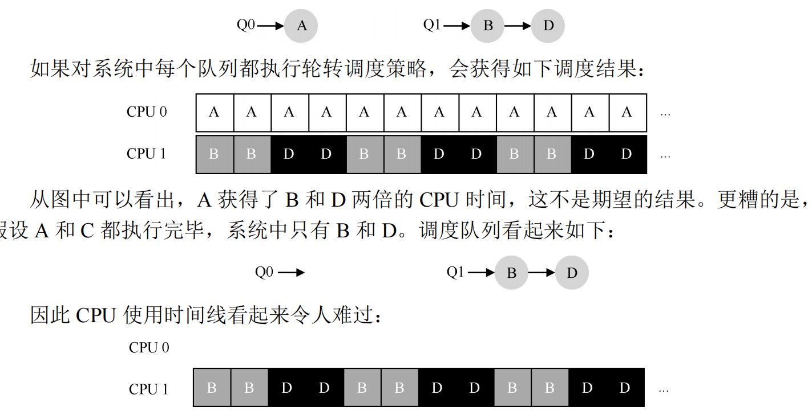
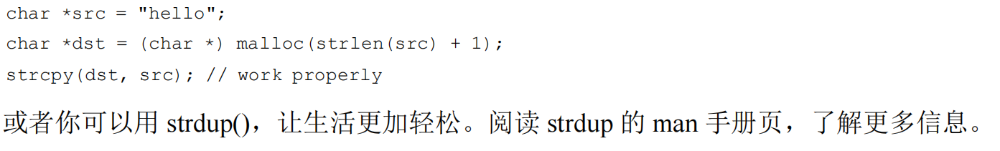

# PartⅠ  虚拟化

## 第4章 抽象：进程

- 通过让一个进程只运行一个时间片，然后切换到其他进程，操作系统提供了存在多个虚拟CPU的假象。

---

操作系统运行程序的第一件事就是将代码和所有静态数据加载到内存中，加载到进程的地址空间中；还需要在运行此进程之前为程序的运行时栈分配一些内存。

在UNIX系统中，默认情况下每个进程都有3个打开的文件描述符，用于标准输入、输出和错误。

---

进程可以处于以下三种状态：

| 运行                             | 就绪               | 阻塞                                                         |
| -------------------------------- | ------------------ | ------------------------------------------------------------ |
| 正在执行指令，进程在处理器上运行 | 进程已经准备好运行 | 在阻塞状态下，一个进程执行了某种操作，直到发生其他时间时才会准备运行 |


## 第5章 插叙：进程API

### 5.1 fork()系统调用

系统调用fork()用于创建新进程

**子进程不会从main函数开始执行，而是从fork系统调用**

- 子进程有自己的地址空间(即自己的私有内存)、寄存器、程序计数器等。

父进程获得子进程的PID，子进程获得的返回值是0。

### 5.2 wait()系统调用

wait()系统调用会在子进程运行结束后才返回

### 5.3 exec()系统调用

这个系统调用可以让子进程执行与父进程不同的程序

### 5.4 为什么这样设计API

shell也是一个用户程序，它首先是一个提示符(prompt)，然后等待用户输入。可以向它输入一个命令，大多数情况下，shell可以在文件系统中找到这个可执行程序，调用fork()创建新进程，并调用exec()的变体来执行这个可执行程序，调用wait()等待该命令完成。子进程结束后，shell从wait返回并再次输出一个提示符，等待下一个命令。

- fork和exec的分离，让shell可以方便实现很多功能


## 第6章 机制：受限直接执行

### 6.1 基本技巧：受限直接执行

### 6.2 问题1：受限制的操作

直接执行的明显优势是快速。该程序直接在硬件CPU上运行。但是如果进程希望执行某种受限操作(如向磁盘发出I/O请求或获得更多系统资源(如CPU或内存))，该怎么办？

---

为了防止任何用户进程向磁盘发出I/O等越权行为的操作，我们引入一种新的处理器模式，称为**用户模式**。在用户模式下运行的代码会受到限制。例如，在用户模式吓，进程不能发出I/O请求。

**内核模式**下运行的代码可以做受限指令。

- 如果用户希望执行特权操作，就要执行系统调用

要执行系统调用，程序必须执行特殊的陷阱指令。该指令同时跳入内核并将特权级别提升到内核模式。返回时回到用户模式。

---

- 陷阱如何知道在OS内运行那些代码


### 6.3 问题2，在进程之间切换

如果一个进程在CPU上运行，这就意味着操作系统没有运行。如果操作系统没有运行，那么如何实现进程的切换？

- 协作方式：等待系统调用

运行时间过长的进程被假定会定期放弃CPU，以便操作系统可以决定运行其他任务。**大多数进程通过系统调用，将CPU的控制权转移给操作系统**。

OS通过被动等待系统调用或者某种非法操作发生，从而重新获得CPU控制权，不太理想。

- 非协作方式：操作系统进行控制

没有硬件的帮助，如果进程拒绝进行系统调用，那么操作系统永远无法重获CPU控制权

**时钟中断**：操作系统在每个几毫秒发生的时钟中断时，运行预先配置的中断处理程序，此时操作系统重获CPU控制权。

---

- 保存和恢复上下文

如果切换进程，那么OS就要执行一些底层代码，即上下文切换：OS要为正在执行的进程保存一些寄存器的值(到它的内核栈)，并为即将执行的进程恢复一些寄存器的值(从它的内核栈)。

**通过切换栈**实现:point_up_2:


## 第7章 进程调度：介绍

- FIFO(先进先出)
- 最短任务优先(SJF)
- 最短完成时间优先(STCF)

## 第8章 调度：多级反馈队列

通常我们队进程的执行时间、大小一无所知，如何调度程序？

### 8.1 MLFQ：基本规则

MLFQ中有许多独立的队列，每个队列有不同的优先级。任何时刻，一个工作只能存在于一个队列中，MLFQ只执行优先级高的工作。**没有为每个工作指定不变的优先级，而是根据观察到的行为调整其优先级**。

### 8.2 尝试1：如何改变优先级

MLFQ会有缺点：会产生饿死问题。如果系统有很多交互性工作，就会不断占用CPU，导致长工作永远无法得到CPU。

### 8.3 尝试2：提升优先级

- 周期性提升所有工作的优先级——经过一段时间，就将系统中所有工作重新加入最高优先级队列。

此处，添加时间段S的值应该如何设置。如果S设置的太高，长工作会借；如果设置的太低，交互性工作得不到合适的CPU时间比例。

### 8.4 尝试3：更好的计时方式

为MLFQ的每层队列提供更完善的CPU计时方式。调度程序应该记录一个进程在某一层中消耗的的总时间，而不是在每次调度到它时重新计时。只要进程用完了自己的配额，就降低一个优先级。

---

最终的MLFQ规则：

  规则 **1**：如果 A 的优先级 > B 的优先级，运行 A（不运行 B）。

  规则 **2**：如果 A 的优先级 = B 的优先级，轮转运行 A 和 B。

  规则 **3**：工作进入系统时，放在最高优先级（最上层队列）。

  规则 **4**：一旦工作用完了其在某一层中的时间配额（无论中间主动放弃了多少次CPU），就降低其优先级（移入低一级队列）。

  规则 **5**：经过一段时间 *S*，就将系统中所有工作重新加入最高优先级队列。

**MLFQ不需要对工作的运行方式有先验知识，而是通过观察工作的运行来给出对应的优先级**。


## 第9章 调度：比例份额

优势也成为公平份额调度程序：调度程序的最终目标，是确保每个工作获得一定比例的CPU时间，而不是优化周转时间和响应时间

---

<font color=Red>看的有点懵 等重看</font>


## 第10章 多处理器调度(高级)

### 10.1 背景：多处理器架构

多处理器与单CPU的基本区别：核心在于**对硬件缓存(cache)的使用，以及多处理器之间共享数据的方式**。

- 缓存是基于局部性的概念：时间局部性和空间局部性。

时间局部性：当一个数据被访问后，它可能不久后被再次访问，比如循环代码中的数据或指令本身。

空间局部性：当访问地址为x的数据时，可能会紧接着访问x周围的数据，比如遍历数组或指令的顺序执行。

---


- 缓存一致性：

假设一个运行在 CPU 1 上的程序从内存地址 A 读取数据。由于不在 CPU 1 的缓存中，所以系统直接访问内存，得到值 *D*。程序然后修改了地址 A 处的值，只是将它的缓存更新为新值 *D'*。将数据写回内存比较慢，因此系统（通常）会稍后再做。假设这时操作系统中断了该程序的运行，并将其交给 CPU 2，重新读取地址 A 的数据，由于 CPU 2 的缓存中并没有该数据，所以会直接从内存中读取，得到了旧值 *D*，而不是正确的值 *D'*。

**总线窥探**：每个缓存都通过监听链接所有缓存和内存的总线，来发现内存访问。如果CPU发现对它放在缓存中的数据的更新，会作废本地副本(从缓存中移除)，或更新它。

### 10.3 缓存亲和度

- 缓存亲和度

一个进程在某个CPU上运行时，会在该CPU缓存中维护许多状态。下次该进程在相同CPU上运行时，由于缓存中的数据而执行的更快。相反，在不同CPU上运行，会犹豫需要重新加载数据而很慢。**多处理器调度应该考虑到这种缓存亲和度性，尽可能将进程保持在同一个CPU上**。

### 10.4 单队列调度

- SQMS(单队列多处理器调度)

多处理器系统的调度，最基本的方式是复用单处理器调度的基本架构

然而有几个明显短板：缺乏可扩展性，需要加锁，于是便会浪费性能；假设每个工作依次执行一个时间片，然后选择另一个工作，因此每个工作都不断在不同CPU之间转移，这**违背了缓存亲和**。

### 10.5 多队列调度

- MQMS(多队列多处理器调度)

每个CPU一个队列。当一个工作进入系统后，系统会依照某个规则将其放入某个调度队列。

MQMS也有问题：负载不均衡



**解决方案**：迁移。通过工作的跨CPU迁移，真正实现负载均衡

**如果太频繁的检查其他队列，就会带来较大的开销**


## 第13章 抽象：地址空间

### 13.1 早期系统

- 操作系统曾经是一组函数(实际上是一个库)，在内存中，有一个正在运行的程序，在物理内存中，并使用剩余的内存。


### 13.2 多道程序和时分共享

一种实现时分共享的方案：让一个进程单独占用全部内存运行一小段时间然后停止，并把他的所有状态信息保存在磁盘上(包括所有的物理内存)，加载其他进程的状态信息，再运行一段时间。

**然而**，这种方案太慢了，特别是当内存增长的时候。将全部内存信息保存到磁盘非常慢！

因此，**在进程切换的时候，仍然将进程信息放在内存中**。


### 13.1 地址空间

操作系统提供一个物理内存的抽象：**地址空间**，这是运行的程序看到的系统中的内存。

- 进程的地址空间包含运行的程序的所有内存状态，如代码。


操作系统在虚拟化内存，因为运行的程序认为它被加载到特定地址的内存中，并且具有非常大的地址空间。

### 13.4 目标

- 程序不应该感知到内存被虚拟化的事实，相反，程序的行为就好像它拥有自己的物理内存。操作系统(和硬件)完成了让不同工作复用内存的工作。


## 第14章 插叙：内存操作API

### 14.1 内存类型

### 14.2 malloc()调用

```c
#include<stdlib.h>
...
void *malloc(size_t size);
```

实际上甚至不需要包含头文件stdlib.h，因为**C库是C程序默认链接的**

对malloc的调用使用sizeof()操作符去申请正确大小的空间，在C中它被认为是编译时操作符，不同于函数调用(函数调用时在运行时发生的)

### 14.4 常见错误

- 忘记分配内存

可以这么操作：



- 没有分配足够的内存


对于字符串，一般需要申请strlen()+1的大小

---

操作系统会在程序结束时收回进程的所有内存状态(包括用于代码、栈，以及相关堆的内存页)

### 14.6 其他调用

- calloc()分配内存，并在返回之前将其置零(即初始化了)
- realloc()创建一个新的更大的内存区域，将旧区域复制到其中，并返回新区域的指针

## 第15章 机制：地址转换

- 地址转换：硬件对每次内存访问进行处理，将指令中的虚拟地址转换为数据实际存储的物理地址。

### 15.3 动态(基于硬件)重定位

- 基址加界限机制(动态重定位)：每个CPU需要两个硬件寄存器：基址(base)寄存器和界限(bound)寄存器。

当程序执行时，OS决定其在物理内存中加载的实际地址，并将起始地址记录在基址寄存器中。

physical address = virtual address + base

**界限寄存器在此处提供访问保护**，确保进程产生的所有地址都在晋城的地址“界限”中

- 这一堆寄存器是内存管理单元(Memory Management Unit, MMU)


### 15.5 操作系统的问题

- 硬件支持和操作系统管理结合在一起，实现一个简单地虚拟内存

1. 在进程创建时，操作系统检索空闲列表(free list)，为进程的地址空间找到内存空间。
2. 在进程终止时，操作系统回收它的所有内存状态，并放回空闲列表。
3. 在上下文切换时，由于每个CPU只有一个基址寄存器和界限寄存器，但对于每个运行的程序，它们的值都不同，操作系统必须保存MMU到内存，放在每个进程都有的结构中，如近程结构或者进程控制块(PCB)并且在恢复执行的时候恢复MMU。

当一个进程试图越界访问内存时，CPU应该触发异常：终止错误进程

---

简单的动态重定位技术有**效率低下**的问题，如果进程使用的栈区和堆区并不很大，那么会导致浪费大量空间，形成内部碎片。


## 第16章 分段

- 如果将整个地址空间放入物理内存，那么栈和堆之间的空间并没有被进程使用，确依然占用了实际的物理内存

利用MMU实现的虚拟内存很浪费。而且，如果剩余物理内存无法提供连续区域来放置**完整的地址空间**，进程便无法运行。

### 16.1 分段：泛化的基址/界限

- 在MMU中引入不止一个基址和界限寄存器对，而是**给地址空间内的每个逻辑段一对**。

一个端只是地址空间里的一个连续定长的区域，在典型的地址空间里有3个逻辑不同的段：代码、栈和堆

**分段的机制使得操作系统能够将不同的短放到不同的物理内存区域，从而避免了虚拟地址空间中的未使用部分占用物理内存**


只有**已用内存**才在物理内存中分配空间，因此可以容纳巨大的地址空间，其中**包含大量的未使用的地址空间**(优势又被称为系数地址空间)


Hint:编程时经常遇到Segmentation Fault......

### 16.2 引用哪个段

硬件在地址转换时使用段寄存器，通过显式方式获知段内偏移量和地址引用了哪个段：用虚拟地址的开头几位来标识不同的段。


上图是14位虚拟地址的前两位来标识3个段。使用两位来区分三个段，会造成一个段的地址空间被浪费，因此有些系统会将堆和栈当做同一个段，于是只需要一位做标识便可。

### 16.3 栈怎么办

由于栈是向上增长的。所以地址转换必须有所不同。

- 除了基址和界限外，硬件还需要直到段的增长方向(用一位区分，比如1标识从小到大，0反之)

### 16.4 支持共享

- 为了节省内存，有时要在地址空间之间共享某些内存段

为每个段增加几个位作为保护位，标识程序是否能够读写该段，或执行其中的代码

---

- 问题：会导致外部碎片


在这个例子中，一个进程需要分配一个20KB的段，当前有24KB的空闲，单兵不连续。因此，OS无法满足这个20KB的请求。


## 第17章 空闲空间管理

### 17.2 底层机制

- 分割与合并


在申请时分割，在归还时合并。


- 追踪已分配空间的大小

free(void *ptr)没有块大小的参数，因为它假定对于给定的指针吗内存分配哭可以很快确定要释放空间的大小，从而将它放回空闲列表。

大多数分配程序会在头块中保存一点额外信息，它在内存中，通常在返回的内存块之前。


- 嵌入空闲列表：需要在空闲空间本身中建立空闲空间列表。

### 17.3 基本策略

- 最优匹配

首先遍历整个空闲列表，找到和请求大小一样或更大的空闲快，然后返回这组候选这种最小的一块。

**选择最接近用户请求大小的块从而避免空间浪费**。**然而代价是遍历查找的时候要付出较高的性能代价**。


- 首次匹配

找到第一个足够大的块将请求空间返回给用户。

**有速度优势，但有时会让空闲列表开头部分有很多小块**。


- 下次匹配

该算法多维护一个指针，指向上一次查找结束的位置，**避免了对列表开头频繁的分割**。


## 第18章 分页：介绍

- 分页：将内存分割成固定大小的单元，每个单元称为一页。将物理内存看作定长槽块的阵列，叫做页帧。每个页帧包含一个虚拟内存页。

### 18.1 一个简单的例子

- 分页优点：灵活性、简单地管理空闲空间。

通过完善分页方法，OS可以高效的提供地址空间的抽象，无论进程如何使用地址空间。例如**我们不会假定堆和栈的增长方向**。

---

OS为每个进程保存一个数据结构，称为**页表**，用于为地址空间的每个虚拟页面保存地址转换，从而获得每个页在物理地址中的位置。

### 18.2 页表存在哪里

由于页表非常大，所以不利用硬件存储，而是使用内存来存储每个进程的页表。


## 第19章 分页：快速地址转换(TLB)

- 地址转换旁路缓冲存储器(TLB)，它就是频繁发生虚拟到物理地址转换的硬件缓存。

对于每次内存访问，硬件先检查TLB是否有期望的转换映射，如果有就完成转换(不需要访问页表)。

### 19.1 TLB基本算法

首先从虚拟地址中提取页号(VPN)，检查TLB是否有该VPN的转换映射。如果有，那么TLB命中，可以从TLB中提取页帧号(PFN)，与原来虚拟地址中的偏移量组合成物理地址。如果没有找到，硬件访问页表来寻找转换映射，并用该转换映射更新TLB。

### 19.3 谁来处理TLB未命中

- 硬件全权处理TLB未命中。

硬件必须知道页表在内存中的确切位置以及页表的确切格式。发生未命中时，硬件会“遍历”页表，找到正确的页表项，去除想要的转换映射，更新TLB并重试该指令。


### 19.5 上下文切换时对TLB的处理

- TLB包含的地址映射只对当前进程有效，对其他进程是没有意义的。

在TLB中添加一个地址空间标识符(ASID)，可以吧ASID看作是进程标识符，但通常比PID位数少。

### 19.6  TLB替换策略

- 在向TLB添加新项时，应该替换旧值，采用**最近最少使用(LRU)项**的策略。


## 第20章 分页：较小的表

页表太大，因此小号的内存太多

### 20.2 混合方法：分页和分段

- 不为进程的整个地址空间提工单个页表，而为每个逻辑分段提供一个

依然保留基址寄存器和界限寄存器。在此处，基址寄存器保存该段的页表的物理地址；界限寄存器用于指示页表的结尾(即它有多少有效页)。


用地址空间前两位确定使用哪个段。

**栈和堆之间未分配的页不在占用页表中的空间(仅将其标记为无效)**

然而，**分段假设地址空间有一定的使用模式**，如果有一个大而稀疏的堆，仍然有可能导致大量的页表浪费。

### 20.3 多级页表

- 将页表分成页大小的单元。如果整页的页表项(PTE)无效，就完全不分配该页的页表。使用页目录体现页表的页在哪里，或页表的整个页不包含有效页。


左侧线性页表，即使地址空间中建达部分区域无效，仍然需要为之分配页表空间。

右侧多级页表，仅将页表的两页标记有效，驻留在内存。


页目录为每页页表包含了一项。由多个页目录项(PDE)组成。PDE至少拥有**有效位**和**页帧号**。如果ODE项是有效的，则意味着该项指向的页表中至少有一页是有效的。


- 多级页表也是有成本的，TLB未命中时，需要从内存加载两次，才能从页表中获得正确信息(一次用于页目录，一次用于PTE本身)，而线性页表只需要一次加载。

### 20.5 将页表交换到磁盘

- 无论如何处理，页表也有可能太大而无法一次装入内存。一些系统将这样的页表放入虚拟内存中，从而在系统压力较大的时候，把这些页表中的一部分交换到磁盘。


## 第21章 超越物理内存：机制

- OS把当前没有在用的那部分地址空间存储到磁盘，以支持更大的地址空间。

### 21.1 交换空间

- 交换空间：在硬盘上开辟一部分空间用于物理页的移入和移出。**假定OS能够以页大小为单元读取或写入交换空间**。OS需要记住给定页的硬盘地址。


### 21.2 存在位

当硬件在PTE中查找时，如果发现页不再物理内存中。硬件判断是否在内存中的方法是：通过页表项中的一条新信息，即存在位。如果为1就在物理内存中，为0则在硬盘上。

**访问不再物理内存中的页，这种行为被称为页错误**。

### 21.3 页错误

- OS负责处理页错误(即由软件来处理)

当OS收到页错误时，在PTE中查找地址，将请求发送到磁盘，将页读取到内存中。

**当I/O运行时，进程将处于阻塞状态**，因此，当处理页错误时，OS可以自由运行其他进程。

### 21.4 页错误处理流程


## 第22章 超越物理内存：策略

### 22.3 简单策略：FIFO

- 页在进入系统时，简单地放入一个队列。当发生替换时，队列尾部的页被踢出。

任何像FIFO或随机这样简单的策略都可能会踢出一个重要的页，而这个页马上就要被引用。

---

LRU策略。

### 22.10 其他虚拟内存策略

- 在内存中收集一些待完成写入，然后一起写入硬盘。**磁盘驱动器性质：执行单次大的写操作，比许多小的写操作更有效**。

### 22.11 抖动

- 当内存被超额请求时，系统将不断进行换页，这种情况被称为**抖动**。

现代有的OS会直接杀死申请超额内存的进程。

# PartⅡ 并发

**线程共享地址空间，从而能够访问相同的数据**

线程之间的上下文切换类似进程之间的上下文切换

---

- 对于进程，将状态保存到进程控制款PCB(Process Control Block)

- 对于线程，控制控制块TCB(Thread Conrtol Block)

---

**线程之间的上下文切换 地址空间保持不变(不需要切换当前使用的页表)  进程的切换需要**

多个线程可能共同执行的代码段称为**临界区** 一般不允许多个线程同时执行临界区代码

## 第27章 线程API

### 27.1线程创建

```c
//创建线程
int pthread_create(pthread_t *thread,
           const pthread_attr_t *attr,
           void (*start_routine)(void*),
           void *arg);
```

---

- thread-local变量

``` c
__thread int x;
__thread char *s;
```

类似这种以__thread定义的变量   是线程本地变量  会在创建的每一个线程中都保留一个副本

### 27.2线程完成

```c
//等待线程结束
int pthread_join(pthread_t thread,void **value_ptr)
//注意其第二个参数的类型是pointer to pointer
```

pthread_join()的第二个参数是一个指针，指向希望得到的返回值，如果不需要返回值，那么也可以传入NULL

### 27.3 锁

```c
int pthread_mutex_lock(pthread_mutex_t *mutex);
int pthread_mutex_unlock(pthread_mutex_t *mutex);
```

如果意识到有一段代码是一个临界区，那么就需要通过锁来保护

---

**所有的锁必须正确初始化 以确保他们具有正确的值 并在锁和解锁被调用时按照需要工作**

**初始化锁：**

- ①使用PTHREAD_MUTEX_INITIALIZER

``` c
pthread_mutex_t lock=PTHREAD_MUTEX_INITIALIZER
```

- ②动态方法 调用pthread_mutex_init()

```c
int rc=pthread_mutex_init(&lock,NULL);
assert(rc==0)  //alwasy check success!
```

第一个参数是锁本身的地址，第二个参数是可选属性

### 27.4 条件变量

当线程之间必须要发生某种信号时  如果一个线程在等待另一个线程继续执行某些操作，条件变量很有用

```c
int pthread_cond_wait(pthread_cond_t *cond,pthread_mutex_t *mutex);//使调用线程进入休眠状态
int pthread_cond_signal(pthread_cond_t *cond);
```

要使用条件变量 必须另外有一个与此条件相关的锁 **在调用函数时  要持有这个锁**

---

典型用法：

```c
pthread_mutex_t lock=PTHREAD_MUTEX_INITIALIZER;
pthread_cond_t cond=PTHREAD_COND_INITIALIZER;
pthread_mutex_lock(&lock);
while(ready==0)	
    pthread_cond_wait(&cond,&lock);
pthread_mutex_unlock(&lock);
```

在初始化相关锁和条件后 一个线程检查变量ready是否已经被设置为0意外的值 如果没有 就调用等待函数休眠 直到其他线程唤醒它

---

唤醒线程的代码：

```c
pthread_mutex_lock(&lock,NULL);
ready=1;
pthread_cond_signal(&cond);
pthread_mutex_unlock(&lock);
```

- **等待调用将锁作为第二个参数  而信号调用只需要一个参数：**因为等待调用除了使线程进入睡眠状态外，还会**让调用者在睡眠的时候释放锁(不然其他线程怎么获得锁  修改临界区内容从而唤醒该线程捏？)**

- **在被唤醒之后、返回之前，pthread_cond_wait()会重新获得该锁** 确保整个过程都持有锁

---

**每个线程都有自己的栈**：线程的局部变量是线程私有的。线程之间共享数据，值要在堆区或者其他全局可访问的位置：e.g. ①刚刚的例子中ready就是全局变量  ②malloc出来的动态内存是位于堆区的

## 第28章 锁

并发编程最基本问题：我们希望原子式执行一系列指令  但是由于单处理器上的中断(或者多个线程在多处理器上并发执行)我们做不到

**所以我们运用锁**

### 28.1 锁的基本思想

- lock()尝试获取锁  如果没有其他线程持有锁 那么该线程会获得锁  进入临界区  如果锁被另一线程持有 那么该调用就不会返回 **这样 当持有该锁的线程位于临界区  其他线程就无法进入临界区**

锁的持有者一旦unlock() 锁就变成可用的了：

①如果没有其他等待线程(即没有其他线程用过lock()并卡在那里) 锁就变成可用状态

②如果有线程卡在lock() **其中一个**就会注意到锁状态的变化  获得该锁  进入临界区

### 28.2 Pthread锁

- 任何临界区都是用同一个大锁(粗粒度方案)

- 用不同的锁保护不同的数据和结构  从而允许更多线程进入临界区(细粒度方案)

### 28.4 评价锁

①锁是否有效  能够阻止多个线程进入临界区

②公平性 当锁可用时  是否每一个竞争线程有公平的机会抢到锁  **是否有竞争锁的线程会饿死 一直无法获得锁**

③性能 使用锁之后增加的时间开销

### 28.5 控制中断

最早的互斥解决方案质疑  是**在临界区关闭中断**

- 优点：没有中断 线程可以确定它的代码会继续执行下去 不会被其他线程干扰

- 缺点： 要求我们允许所有调用线程执行特权操作(打开关闭中断)即信任这种机制不会被滥用

①一个贪婪的程序可能在开始的时候就调用lock()  从而独占处理器 如果一直死循环就必须重启系统了

②不支持多处理器  如果多个线程运行在不同CPU上 每个线程都试图进入同一个临界区 **即使关闭中断也没有用  线程可以运行在其他处理器上**

③关闭中段导致中断丢失 假如磁盘完成IO读取 但CPU错失了这一事实 那么操作系统如何知道去唤醒等待读取的进程

④效率低

### 28.6 测试并设置指令(原子交换)

如果没有硬件支持 自旋锁   自旋等待在等待其他线程释放锁的时候会浪费时间

尤其是在单处理器上的上 一个等待线程 等待的目标甚至无法运行

### 28.7 实现可用的自旋锁

自旋锁 一直自旋 利用CPU周期 直到锁可用

在单处理器上，需要抢占式的调度器，即不断通过时钟中断一个线程，运行其他线程。否则，自旋锁在单CPU上无法使用 **因为一个自旋的程序永远不会放弃CPU**

### 28.8 评价自旋锁

①正确

②不公平  自旋的线程在竞争条件下可能会永远自旋   可能会导致饿死

③ 单CPU 性能开销相当大  (加上一个线程持有锁进入临界区时被抢占  调度器可能会运行其他每一个线程。而其他线程都在竞争锁 都会在放弃CPU之前 自旋一个时间片 浪费CPU周期)

​	多CPU **性能还不错**(如果线程数大致等于CPU数)

### 28.9 比较并交换

- 无等待同步   比较并交换强于测试并设置

- 自旋锁实现   两者无差别

### 28.10 链接的加载和条件式存储指令

```c
//加载
int LoadLinked(int *ptr){
    return *ptr;
}
//条件存储
int StoreConditional(int *ptr,int value){
    if(no one has updated *ptr since the LoadLinked to this address){
        *ptr=value;
        return 1;   //success!
    }else return 0; //failed to update
}
```

条件式存储：只有在上一次加载的地址在期间都没有更新时 才会成功

### 28.11 获取并增加

原子地返回特定地址的旧值，并且让该值自增1

此处查看原书代码

- 本方法能够保证所有线程都能抢到锁

### 28.12&28.13 解决自旋过多

- 在要自旋的时候放弃CPU 让其他线程运行 **让出线程本质上取消调度了它自己**。

在单处理器上 yield方法十分有效。

然而如果多线程反复竞争一把锁。假如有100个线程，一个线程持有锁，在释放锁前被抢占，其他99个线程分别调用lock()，发现锁被抢占，然后让出CPU。那么这99个程序会一直处于运行yield这种模式 直到持有锁的线程再次运行   **上下文切换成本太大**  **而且可能会有饿死情况  一个线程不断谦让地yield  而其他线程反复进入临界区**

### 28.14 使用队列：休眠替代自旋

自旋和让出CPU(yield)真正问题是**存在太多偶然性** 调度程序决定如何调度 如果调度不合理就会出问题

因此  必须显式地事假某种控制    **决定锁释放时 谁能抢到锁**  需要一个队列来保存等待锁的线程

- Solaris提供的支持：  

| park()         | unpark(threadID)   |
| -------------- | ------------------ |
| 让调用线程休眠 | 唤醒threadID的线程 |

```c
//通过队列来控制  避免饿死
typedef struct{
    int flag;
    int guard;
    queue_t *q;
}lock_t;

void lock_init{
    m->flag = 0;
    m->guard = 0;
    queue_init(m->q);
}

void lock(lock_t *m){
    while(TestAndSet(&m->guard,1) == 1)
        ;
    if(m->flag==0){
        m->flag=1; //有线程获得锁了
        m->guard=0;
    }else{
      	queue_add(m->q,gettid());  //挨个让未获得锁的线程入队并让他们休眠
        m->guard = 0;
        park();
    }
}

void unlock(lock_t *m){
    while(TestAndSet(&m->guard,1) == 1)
    	;
    if(queue_empty(m->q))
        m->flag = 0;
    else
        unpark(queue_remove(m->q)); //一次只让一个线程醒过来 hold lock for next thread!!
    m->guard = 0; 
}
```

PS.思索了一阵子终于想通 有种大仇得报的感觉......

- 唤醒线程是从该线程休眠的地方继续执行的，那么怎么让从park()处苏醒的线程获得锁呢？**就是直接将释放锁的线程的权限转交传递给获得锁的线程**

---

- **可能出现的竞争条件** 在一个线程将要park()之前 切换到持有锁的线程 并且它释放了锁，那么之前的那个将要park()的线程将长眠不醒。**因为线程已经入队，但是还没睡就被持有锁的线程通过unlock()从队里pop出来并唤醒，那么等到我要睡的时候，就醒不过来了**

---

Solaris通过separk()调用解决这个问题。通过该函数，线程表明自己马上就要park。如果刚好另一个线程被调度了并且调用了unpark，那么后面我自己的park就直接返回，不睡觉了。

### 28.15 Linux提供futex

每个futex都关联一个特定的物理内存位置，也有一个事先建好的内核队列   调用者通过futex调用来睡眠或者唤醒

## 第29章 基于锁的并发数据结构

### 29.1并发计数器

- 普通的计数器通过在增加和减少的时候上锁实现   但是性能非常差

---

**可扩展计数** 懒惰计数器：

每个CPU有一个局部计数器，然后有一个全局计数器。每个局部计数器有一个锁，全局计数器有一个锁。如果一个核心上的线程想要增加计数器，那么就增加他的局部计数器。局部值会定期转移到全局计数器。


本章比较无聊....


## 第30章 条件变量

- 锁并不是并发程序设计所需要的**唯一原语**

很多时候 线程需要检查某一条件满足之后 才会继续运行

可以尝试用 共享变量 但是效率很低 因为主线程会自旋检查 浪费CPU时间

### 30.1 定义和程序

条件变量是一个显式队列，当某些状态不满足时，线程可以把自己加入队列，等待该条件；另外某些线程改变了上述状态时，就可以唤醒一个或多个等待线程(通过在该条件上发信号)。

```c
int pthread_cond_wait(pthread_cond_t *cond,pthread_mutex_t *mutex);//使调用线程进入休眠状态
int pthread_cond_signal(pthread_cond_t *cond);
```

- 要使用条件变量 必须另外有一个与此条件相关的锁 **在调用wait和signal时必须持有锁**

- **等待调用将锁作为第二个参数  而信号调用只需要一个参数：**因为等待调用除了使线程进入睡眠状态外，还会**让调用者在睡眠的时候释放锁(不然其他线程怎么获得锁  修改临界区内容从而唤醒该线程捏？)**

- 在被唤醒之后、返回之前。pthread_cond_wait()会重新获得该锁 确保整个过程都持有锁

### 30.2 生产者/消费者(有界缓冲区)问题

- Mesa语义：

  ​	如果将wait和signal放入if中，将会产生此语义。假设一种情况有一个生产者和多个消费者。在consumer1被生产者唤醒后，但是在它运行之前，缓冲区的状态改变了(因为consumer2)，那么consumer1醒后将会触发assert。**发信号给线程只是唤醒它们，暗示状态发生了变化，但是并不会保证在它运行之前状态一直是期望的情况**

**较好但仍有问题的解决方案：使用While语句代替If**

- 当将if改为while后，当consumer1被唤醒后，会第一时间检查共享变量，如果此时缓冲区为空，消费者就会回去继续睡眠

**由于Mesa语义，关于条件变量有一条规则：总是使用while循环**

------

单值缓冲区的生产者/消费者方案：

​	如果生产者和消费者使用同一个条件变量的话，可能会导致三个线程同时睡眠。所以**生产者和消费者应该使用不同的条件变量** 

---

最终的生产者/消费者方案：

​	**提高并发和效率**      增加更多缓冲区槽位，这样睡眠之前可以生产多个值，同样睡眠之前也可以消费多个值。

- ①单个消费者和生产者时，上下文切换少，提高效率

- ②多个消费者和生产者时，支持并发生产和消费，从而提高了并发

```c
//最终的put()和get()方法
int buffer[MAX];
int fill=0;
int use=0;
int count=0;

void put(int value){
    buffer[fill]=value;
    fill=(fill+1)%MAX;
}

int get(){
    int tmp=buffer[use];
    use=(use+1)%MAX;
    count--;
    return tmp;
}
```

```c
//最终有效方案
pthread_cond_t empty,fill;
pthread_mutex_t mutex;

void *producer(void *arg){
    int i;
    for(i=0;i<loops;++i){
        pthread_mutex_lock(&mutex);
        while(count==MAX)
           	pthread_cond_wait(&empty,&mutex);
        put(i);
        pthread_cond_signal(&fill);
        pthread_mutex_unlock(&mutex);
    }
}

void *consumer(void *arg){
    int i;
    for(i=0;i<loops;++i){
        pthread_mutex_lock(&mutex);
        while(count==0)
            pthread_cond_wait(&fill,mutex);
       	int tmp=get;
        pthread_cond_signal(&empty);
        pthread_mutex_unlock(mutex);
        return (void*)tmp;
    }
}
```

## 第31章 信号量

- Dijkstra和同事发明了信号量 可以使用信号量作为锁和条件变量

---

### 31.1 信号量的定义

- 信号量是有一个整数值的对象

**信号量的初始值能够决定其行为 所以首先要初始化信号量**

```c
#include<semaphore.h>
sem_t s;
sem_init(s,0,1);
```

sem_init()通过第三个参数将信号量s的值初始化为1

sem_init()的第二个参数为0 ，表示信号量是在同一进程的多个线程共享的

---

信号量初始化之后 调用：sem_wait()和sem_post()与之交互

```c
int sem_wait(sem_t *s){
    decrement the value of semaphore s by one
    wait if value of semaphore s is negative
}

int sem_post(sem_t *s){
    increment the value of semaphore s by one
    if there are one or more threads waiting,wake one
}
```

sem_wait()要么立刻返回(调用时，信号量的值≥1)，要么会让调用线程挂起，直到之后的一个post操作。有可能多个调用线程都调用sem_wait()，因此都在队列中等待唤醒

sem_post()并没有等待某些条件满足。它直接增加信号量的值，如果有等待线成，唤醒其中一个。

**当信号量值为负数的时候，这个值就是等待线程的个数**

### 31.2 二值信号量(锁)

- 信号量的第一种用法：作为锁

信号量的初值至关重要。一般为1。所以也叫二值信号量。

```c
sem_t m;
sem_init(&m,0,1);

sem_wait(&m);
//临界区
sem_post(&m);
```

### 31.3 信号量用作条件变量

```c
sem_t s;

void *child(void *arg){
    printf("child\n");
    sem_post(&s);
    return NULL;
}

int main(int argc,char**argv){
    sem_init(&s,0,0);  //关键
    printf("parent:begin\n");
    pthread_t c;
    pthread_create(c,NULL,child,NULL);
    sem_wait(&s);
    printf("parent:end\n");
    return 0;
}
```

**sem_post()会让信号量+1，即使没有wait()中的线程**

### 31.4 生产者额/消费者(有界缓冲区)问题

```c
int buffer[MAX];
int fill = 0;
int use = 0;

void put(int value){
    buffer[fill] = value;
    fill = (fill + 1) % MAX;
}

int get(){
    int tmp=buffer[use];
    use=(use + 1) % MAX;
    return tmp;
}
```

put()和get()函数

```c
sem_t empty;
sem_t full;

void producer(void *arg){
    int i;
    for(int i=0;i<loops;++i){
        sem_wait(&empty);
        put(i);
        sem_post(&full);
    }
}

void consumer(void *arg){
    int i,tmp=0;
    while(tmp!=-1){
        sem_wait(&full);
        tmp=get();
        sem_post(&empty);
        printf("%d\n",tmp);
    }
}

int main(int argc,char**argv){
    //...
    sem_init(&empty,0,MAX);
    sem_init(&full,0,0);
    //...
}
```

- 当MAX等于1，即缓冲区大小为1的时候  该模型工作正常

- 当MAX大于1时，如果有多个生产者消费者，会出现竞态条件：假如两个生产者同时调用put()，T2在T1将fill+1之前执行赋值操作，那么前一个put的数据将会被覆盖

---

解决方案：**互斥**     利用二值信号量来加锁

```c
sem_t empty;
sem_t full;
sem_t mutex;

void producer(void *arg){
    int i;
    for(int i=0;i<loops;++i){
        sem_wait(&mutex);
        sem_wait(&empty);
        put(i);
        sem_post(&full);
        sem_post(&mutex);
    }
}

void consumer(void *arg){
    int i,tmp=0;
    while(tmp!=-1){
        sem_wait(&mutex);
        sem_wait(&full);
        tmp=get();
        sem_post(&empty);
        sem_post(&mutex);
        printf("%d\n",tmp);
    }
}

int main(int argc,char**argv){
    //...
    sem_init(&mutex,0,1);
    sem_init(&empty,0,MAX);
    sem_init(&full,0,0);
    //...
}
```

- 然而还是会有问题：**死锁**

当消费者持有mutex锁时，如果缓冲区为空，那么会被full信号量挂起。但是此时它仍持有mutex。此时对生产着的调用会让mutex出现死锁。

---

解决方案：**缩小锁的作用域**   把mutex放到full和empty之内即可

### 31.5 读者-写者锁

- 读写锁：插入操作需要修改链表结构，而查找操作只需要读取该结构，只要没有插入操作，我们可以并发的执行多个查找操作

- 当第一个读者获得读锁时，他也会获得写锁
- 一单一个读者获得读锁，其他读者也可以获得这个锁。但是想要获得写锁的线程，就必须等到所有读者都结束。最后一个退出的写者，释放写锁。

### 31.6 哲学家就餐问题

哲学家围圆桌吃饭，只有同时获得左右手两个叉子才能吃饭

Dijkstra通过让最后一个人先尝试拿右手叉子，而其他人全都尝试拿左手叉子的逻辑实现

### 31.7 实现信号量

- 用锁和条件变量实现信号量

```c
typedef struct _Zem_t{
    int value;
    pthread_cond_t cond;
    pthread_mutex_t lock;
}Zem_t;

void Zem_init(Zem_t *s,int value){
    s->value=value;
    Cond_init(&s->cond);
    Mutex_init(&s->lock);
}

void Zem_wait(Zem_t *s){
    Mutex_lock(&s->lock);
    while(s->val<=0)
       	Cond_wait(&s->cond,&s->lock);
    s->value--;
    Mutex_unlock();
}

void Zem_post(Zem_t *s){
    Mutex_lock(&s->lock);
    s->value++;
    Cond_signal(&s->cond);
    Mutex_unlock(&s->lock);
}
```

## 第32章 常见并发问题

### 死锁缺陷

预防：

- 循环等待：通过控制获取锁的顺序来预防死锁

通过锁的地址来强制锁的顺序：

假如有这个函数：

```c
do_something(mutex_t *m1,mutex_t *m2);
```

如果一个线程调用do_something（L1,L2)而另一个线程调用do_something(L2,L1)时，就可能产生死锁

根据锁的地址作为获取锁的顺序：

```c
if(m1>m2){
    pthread_mutex_lock(m1);
    pthread_mutex_lock(m2);
}else {
    pthread_mutex_lock(m2);
    pthread_mutex_lock(m1);
}
```

---

本章没什么好说的....


